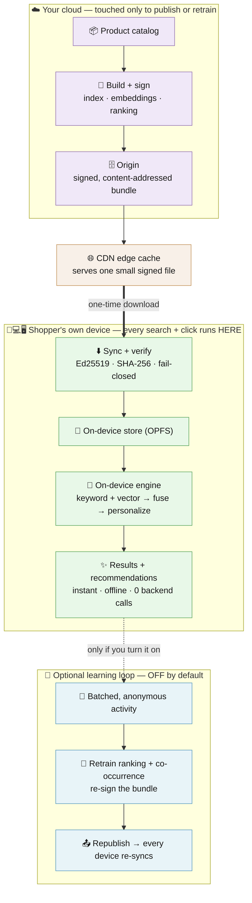

# EdgeReco

> **Sync once. Run anywhere. Zero backend calls.**

[](https://github.com/hseshadr/edge-reco/actions/workflows/ci.yml)
[](LICENSE)
[](https://www.python.org/downloads/)
[](https://www.typescriptlang.org/)
[](https://edge-reco.com)

### ▶ [Try the live demo — edge-reco.com](https://edge-reco.com) · zero install, runs entirely in your browser tab

## Northstar status (verified 2026-07-16)

**The reference storefront is live, offline-capable, and measurable in the browser.**
At this verification, the deployed application code was commit `d5637b1`; hosted CI passed, and the exact build is
live at both `https://edge-reco.com` and an immutable Cloudflare Pages deployment.
The browser smoke test measured a 3.24 s cold boot, 16.9 ms search, 1.2 ms
recommendation, about 18.4 MB JS heap, zero external-origin requests, and zero
backend calls after sync. The live apex also returns HSTS, CSP, COOP, and restrictive
permissions headers.

Verify the public surface yourself:

```bash
curl -fsSLI https://edge-reco.com/
cd frontend && uv run poe gate
```

One boundary is intentionally visible: `www.edge-reco.com` is an external DNS
configuration item and currently serves the site with HTTP 200 instead of the
required permanent redirect to the apex. The repository's automatic Cloudflare
deploy remains fail-closed until that Redirect Rule exists; the deploy workflow
probes it and stays red. The apex and immutable Pages deployment are the verified
production surfaces.

**Every Black Friday, the same thing breaks.** Your store's search and recommendations — the "you might also like," the personalized picks — run on paid cloud services, and your company pays the bill on every search and every click, for every shopper. To survive the one wild hour of the year you rent far more computing power than you need, then pay for it all year. The smartest part of your store is also the most expensive — and the first to fall over right when it matters most.

**EdgeReco flips that.** Your store sends each shopper's browser one small file — your products plus the logic that ranks them — just once. After that, search, ranking, and personalization all run right on the shopper's device, with nothing sent back to a server.

**So every shopper brings their own device — phone, laptop, or in-store kiosk.** The more popular you get, the more capacity you have — your cloud bill stops growing with traffic and drops to the cost of handing out one small file, with no server in the middle to slow down or crash. Results come back in a blink, even on weak or dropped connections.

**And it still gets smarter.** Switch on an optional loop — off by default — and your store learns from anonymous, grouped shopper activity, improves the rankings in the cloud, and sends every device an updated file to pick up on its next visit. The shopping itself always runs on the device; only the learning is optional, and even that never touches a live shopper's results.

**Nimbus is the proof.** It's a pretend store we built on 720 real products so you can watch it happen: search, click a few items, and see the recommendations re-rank — while the "backend calls" counter sits at **0**. ▶ *[Try it live at edge-reco.com](https://edge-reco.com).*

The recommender is **configurable as data**: the scoring weights, the named
strategies behind each rail, and the "also bought" co-occurrence map all ride in
the signed bundle (`ranking_config.json` + `cooccurrence.json`). Retuning ranking
or adding a rail is a bundle republish — no code change, no redeploy — and both
the Python and browser tiers pick it up on the next sync.

This is possible because of [**edge-proc**](https://github.com/hseshadr/edge-proc) —
a reusable local-compute substrate (signed bundle sync, content-addressed cache,
fail-closed verification, and the BM25 ⊕ vector → RRF retrieval primitives).
EdgeReco is the product brain — the scoring formula, the session signals, the
reranker — built on top. See [Built on edge-proc](#built-on-edge-proc).

[](https://edge-reco.com)

> **▶ [Try it live at edge-reco.com](https://edge-reco.com)** — the full engine boots
> in your browser tab, no install and nothing to run. This is the same demo, hosted
> on Cloudflare Pages; everything below runs it locally.

> _Nimbus, the store in the demo, is fictional — built only to demo EdgeReco.
> It is not a real shop. Its products come from a public Amazon dataset — see
> [Data & attribution](#data--attribution)._

## Try it (one command)

You need this repo and Docker. Nothing else.

```bash
cd frontend && docker compose up --build

# then visit http://localhost:5174 in your browser
```

You'll land on a short intro page — hit **"Launch the live demo"** and it boots the
engine right in your tab (a quick loading screen while it fetches the catalog and a
small AI model), then the storefront. A live **metrics strip** shows the real in-tab
numbers as you browse — recommendation latency, memory, and **0 backend calls after
sync**. Click a few products and the recommendations re-rank live. Stop the
containers and reload — it keeps working offline.

**Nimbus is a pretend online store.** The interesting part: its entire
search-and-recommend brain runs *inside your browser tab* — no server, no
backend calls — after a one-time download. So the store works offline, costs
nothing per search, and your clicks, hearts, and cart adds never leave your device.

> _What "one-time download" fetches:_ the signed catalog bundle, the
> `all-MiniLM-L6-v2` embedding model, and the ONNX runtime — **all from the
> demo's own origin**. The model and runtime are mirrored in at build time
> (sha256-pinned), so the running app touches no third-party CDN — a Playwright
> e2e boots the store with every CDN blocked to prove it. Everything is cached,
> so after the first load the engine runs locally and makes **zero backend
> calls**.

Open the store, search for "shirt", then click a couple of
products. Every click reshapes the "Recommended for you" rail across five taste
signals — category, brand, tags, popularity, and freshness — re-ranking
**instantly, on-device, with no trip to a server.** Hearts and cart-adds are stronger signals than clicks, and what you linger on nudges the rail gently. This is the same shape of
per-session personalization big storefronts run server-side; here it runs
entirely in your tab, so your signals never leave your device. The home page also
stacks *Trending* and *New arrivals* rails; click into any product and its page
shows *Similar items*, *Because you viewed*, *Customers also bought*, and
*Frequently bought together* — the full Amazon-style rail set, all computed
in-tab from the same signed bundle. Turn the server off and reload: it still
works, because everything it needs is already on your machine.

That's the whole pitch. EdgeReco is the engine; Nimbus is the demo store built
on top of it.

**Working on the code?** With the toolchain installed (uv + Node + pnpm + Docker),
`poe demo` (or `make demo`) from the repo root does the same thing in one command
and opens the browser for you. It picks **free ports per run** (no fixed `:8081` /
`:5174`), so it never clashes with a stale container or another project. (`cd backend
&& uv run poe demo` works too, e.g. without a global poe install; `make demo` falls
back to it automatically.)

**See the flywheel:** `poe demo-flywheel` adds a "mimicked cloud" collector (also on
a free port) and shows the uplink half of the loop — clicks are captured in-tab
and periodically flushed (batched, fire-and-forget) to the FastAPI `/events`
endpoint, so the cloud can retrain. Signals are intent-graded — toward retrained popularity a cart-add weighs 4×, a favorite 3×, a click 1×, a lingered view 0.2× (the same grading both tiers use in-session). Inference still runs 100% locally; the
uplink is optional and off by default (the plain `poe demo` makes zero backend
calls). Watch the `POST /events` requests and the "N interactions synced to cloud"
badge.

**Close the loop:** after clicking around, `poe demo-retrain` is the cloud half —
it recomputes each product's popularity from the collected events (`--events-url`)
**and** the "customers also bought" co-occurrence map from the session log
(`--sessions`), then **republishes a freshly signed bundle**. Refresh the SPA and the rails re-rank
toward what you clicked, because both tiers re-sync the new popularity and
co-occurrence from the same signed bundle — *no scoring-formula change, no
re-embedding*. That's the whole flywheel: click → cloud → retrain → better rails.
(Re-signing needs the maintainer's private key, `examples/keys/private.key`, so
this step is for repo owners; the published demo ships the result.)

Under the hood `poe demo-retrain` runs `edgereco retrain`, which takes the origin
to sync from, the republish origin, and the signing + verify keys, plus
`--events-url` (the collector's `/events/export`) and `--sessions` (a JSONL
session log to recompute co-occurrence from). Before republishing you can preview
exactly what a retrain would change with the read-only `edgereco audit ORIGIN
VERIFY_KEY --sessions LOG` — it syncs the current signed bundle and prints the
event counts, the top popularity movers, and the changed co-occurrence edges
behind the next ranking update. It never signs, never publishes, and never
touches the inference path.

---

## Under the hood (for developers)

Everything below is the technical depth. Each piece of jargon is defined the
first time it shows up.

Most search/recommendation stacks are glued to a remote backend: every query
crosses the network, every recommendation rebuilds session state in some
service. EdgeReco inverts that. The catalog is distributed like static assets
through a CDN; the engine ships as a small library; inference happens locally —
in a browser tab, or in a Python process. Sync once, run anywhere.

### Built on edge-proc

EdgeReco is two layers, not one. The bottom layer is **edge-proc** — a generic
local-compute substrate: signed, content-addressed bundle sync, an OPFS/CAS
(content-addressed store) cache, Ed25519 + SHA-256 fail-closed verification, and
the hybrid-retrieval primitives (BM25 ⊕ vector → RRF) with FAISS /
transformers.js embedders. The top layer is **edge-reco** — the
product-discovery brain: the scoring formula, the session-signal capture, and
the session-aware reranker.

That dependency is real in both runtimes. The Python side pulls
[`edge-proc[localvec,bundles]`](backend/pyproject.toml#L20); the browser side
runs [`@edgeproc/browser`](frontend/packages/edgeproc-browser/) — _the edge-proc
browser tier_ — over the same signed bundle. The substrate is reusable for any
local search workload; edge-reco is what turns it into recommendations, and the
two tiers are parity-tested against each other.

**The stack is three repos, one system:**

| Repo | Role |
| --- | --- |
| [**edge-reco**](https://github.com/hseshadr/edge-reco) (this repo) | the product brain — scoring formula, session signals, session-aware reranker, the Nimbus demo storefront. |
| [**edge-proc**](https://github.com/hseshadr/edge-proc) | the reusable local-compute substrate — signed bundle sync, content-addressed OPFS/CAS cache, fail-closed Ed25519 + SHA-256 verification, and the BM25 ⊕ vector → RRF retrieval primitives. **This is what makes on-device search possible.** |
| [**shared-libs-python**](https://github.com/hseshadr/shared-libs-python) | the vector-partitioning protocol edge-proc builds its local vector index on. |

You don't need to clone edge-proc or shared-libs-python to build EdgeReco — the
backend pulls them from public GitHub automatically (see
[QUICKSTART](docs/QUICKSTART.md)).

### Architecture


<details>
<summary>Diagram source (Mermaid)</summary>



</details>

- **origin** — serves a *signed, content-addressed bundle*: a `latest` version
  pointer plus immutable `manifest/<hash>` and `chunk/<hash>` objects.
  *Content-addressed* means each file is named by the hash of its bytes, so it
  can be cached forever and can't be tampered with undetectably. A committed
  720-product Amazon bundle lives in `backend/examples/catalog/`.
- **edge** — a Caddy reverse proxy (a small static web server / CDN) applying
  the bundle's cache policy: immutable chunks cached forever, short-TTL pointer.
- **browser tier** — the Nimbus single-page app (SPA) syncs the bundle into
  *OPFS* (Origin Private File System — the browser's per-site sandboxed disk),
  verifies it with Ed25519 signatures + SHA-256 checksums *fail-closed* (any
  mismatch aborts the load) against a key pinned in the SPA build, loads the
  `all-MiniLM-L6-v2` embedding model via transformers.js, and runs the full
  hybrid-search + session-aware rerank pipeline **in the tab**. No application
  backend in the request path.
- **edgereco runtime (Python)** — the same engine packaged as a FastAPI app for
  the server-side use case. Same scoring formula, same sync + verify, same
  prebuilt FAISS index — the in-browser engine (`@edgeproc/browser`) is
  parity-tested against it.

### Distribution and updates

The whole engine ships as **static files on a CDN** — the SPA code, plus a
**signed, content-addressed bundle** holding the product data, the *prebuilt*
vector index, the scoring config (`ranking_config.json`), and the "also bought"
map (`cooccurrence.json`). The live demo serves all of it from Cloudflare Pages
same-origin; any static host or CDN works. On first load the browser syncs the
bundle into OPFS (its per-site disk), verifies it (Ed25519 + SHA-256,
fail-closed), and from then on runs the engine locally.

**Updates are a patch, not a re-download.** Every file is named by the hash of
its bytes, so when you publish a new bundle the client diffs the new manifest
against what's already in OPFS and fetches **only the chunks that changed** —
reusing everything else (notably the large vector index) from the device. A
retrain that just moves `popularity_score` + co-occurrence re-fetches a few small
chunks; the rest is a cache hit. As [DEPLOY.md](docs/DEPLOY.md) puts it: *"a
one-line edit re-publishes one chunk; every consumer fetches one chunk and reuses
the rest."*

**One honest caveat:** the embedding model itself is *not* in the signed bundle
today — it ships as plain same-origin static files instead: the build mirrors
the model into `/models/` and the ONNX wasm runtime into `/ort/`, each file
pinned to its sha256, so a cold first visit fetches everything from the app's
own origin and **no third-party CDN** (a Playwright e2e boots the store with
every CDN blocked to prove it). The bundle is just content-addressed bytes,
though, so it *could* carry the model — signed and patched like the catalog;
folding it into the bundle is a natural next step.

### Installable app — works offline after one sync

The Nimbus storefront is also a **PWA** (Progressive Web App — a website your
browser can install like a native app). On any browser that supports it, you'll
see an "Add to Home Screen" prompt; once installed it opens in its own window,
no browser chrome.

More importantly: **after the first visit, it keeps working with no network.**
A service worker (the browser's background cache manager, powered by Workbox via
`vite-plugin-pwa`) precaches the app shell on first load; the embedding model
(~23 MB, served same-origin from `/models/`) survives offline in transformers.js's
own browser cache, and the ONNX runtime (~23 MB, also served same-origin from
`/ort/`) survives in the service worker's runtime cache. The signed catalog bundle
is already in OPFS — the service worker deliberately never touches it, so the
ed25519 + sha256 integrity guarantees are unchanged.

The catalog's external product-image URLs render as intentional local category tiles,
not remote `` requests. That keeps query-derived results from leaking browsing
interest to an image CDN and makes the storefront visually stable offline. A fork can
ship release-owned root-relative images without changing the boundary. Everything —
hybrid search, browse, and all recommendation rails — runs without a connection.

Prove it yourself:

```bash
pnpm -F frontend test:e2e:offline
```

This Playwright test warms the app online, cuts the network, reloads, and asserts
the store still mounts and ranks — end-to-end, not just a smoke test.

**Two shapes, one engine.** The same scoring runs two ways — backend-free in the
browser, or as an edge-origin FastAPI server — and the two tiers are
parity-tested to return identical results. Pick per use case
([DEPLOY.md](docs/DEPLOY.md)).

> **Roadmap — progressive origin→device handoff.** Because the same engine runs
> on both sides, a deployment can erase the cold start entirely: serve
> recommendations from the origin API while the device downloads artifacts in the
> *background*, then transparently switch to the on-device engine once the bundle
> is synced — no loading gate at all. The foundations are in place (parity-tested
> tiers, a clean client seam, delta sync); the automatic handoff is **not yet
> wired** — today the browser boot is a blocking sync gate and the two shapes are
> separate deployment options.

### How it works

**Hybrid search.** Two retrieval methods run in parallel and get merged.
*BM25* is a classic keyword-relevance score (catches exact matches). *FAISS*
(Facebook AI Similarity Search) does fast nearest-neighbour lookup over
embedding vectors (catches paraphrases — "earbuds" finds "wireless headphones").
The two rankings are fused with *RRF* (Reciprocal Rank Fusion):
`rrf_score = Σ 1/(k + rank_i)` summed over each backend's rank for an item.

**Session-aware reranking.** This is the personalization layer, and it's not a
toy. Every interaction bumps per-session affinity for the product's category,
tags, and brand by a weight that scales with intent:

| event | category | tag | brand |
|---|---|---|---|
| view | +0.02 | +0.01 | +0.02 |
| click | +0.10 | +0.05 | +0.08 |
| favorite | +0.20 | +0.10 | +0.15 |
| cart | +0.25 | +0.12 | +0.20 |

Affinities clamp at 1.0; the last 50 viewed product IDs carry a repetition
penalty so the rail keeps surfacing new things. The reranker rescores the hybrid
candidates against that live profile:

```
score = 0.40·popularity + 0.20·category_aff + 0.15·tag_aff
      + 0.10·brand_aff + 0.10·freshness − 0.25·repetition
```

The loop is **zero-network**: a click folds straight into the in-memory session
profile and the rail re-ranks on the spot — no fetch, no round trip. And it's
not a black box — each result carries a "Why?" breakdown showing exactly which
signal moved it (popularity vs. category vs. tag vs. brand vs. freshness, minus
any repetition penalty). It's all in-memory and per-tab, so reloading starts
fresh.

**Catalog sync.** The origin publishes the signed, content-addressed bundle: a
`latest` version pointer (Ed25519-signed) → an immutable `manifest/<hash>` →
immutable `chunk/<hash>` objects. The consumer fetches `/latest`, verifies its
signature against the pinned public key (fail-closed on tampering), pulls only
the listed chunks, reassembles each bundled file — including the prebuilt FAISS
`vector/` index — into a local cache, and `VectorIndex.load`s it (zero
recompute). After sync, the runtime is fully offline-capable.

**In the browser.** The same pipeline — sync the signed bundle, verify it
Ed25519 + SHA-256, run BM25 ⊕ vector → RRF → session-rerank — runs in the tab
via the [`@edgeproc/browser`](frontend/packages/edgeproc-browser/README.md)
workspace package. The browser embedder is `Xenova/all-MiniLM-L6-v2` via
transformers.js, the byte-for-byte equivalent of the Python encoder, and the
top-k is parity-tested against the FastAPI runtime over the same bundle. See
[`frontend/README.md`](frontend/README.md) for the storefront over this engine.

### Quickstart — publish → sync → serve (Python API, no Docker)

For the **optional** server-side API variant (the FastAPI runtime, not used by
the headline browser demo above), reproduce the delivery loop with the bundle
CLI:

```bash
cd backend
uv sync --group dev

# 1. build a catalog jsonl from a scraped-Amazon CSV
uv run edgereco build-catalog products.csv /tmp/staging/products.jsonl

# 2. build the FAISS vector index into the staging dir
uv run edgereco index /tmp/staging /tmp/staging

# 3. sign + publish a content-addressed bundle origin
uv run edgereco bundle /tmp/staging /tmp/origin examples/keys/private.key \
    --catalog-id amazon-demo --version v1 --product-count 720

# 4. serve by syncing that origin (filesystem URL works too) + verifying the key
EDGERECO_BUNDLE_BASE_URL=/tmp/origin \
EDGERECO_VERIFY_KEY_PATH=examples/keys/public.key \
EDGERECO_BUNDLE_CACHE_DIR=/tmp/bundle-cache \
    uv run edgereco serve /tmp/staging /tmp/staging --port 8000
```

The committed `backend/examples/catalog/` is exactly such an origin (built from
the 720-product Amazon catalog), so step 4 alone — pointed at it — serves the
demo data.

### CLI

```
edgereco build-catalog INPUT.csv OUTPUT.jsonl           # scraped-Amazon CSV -> products.jsonl
edgereco preprocess INPUT.csv OUTPUT_DIR [--limit N]    # Kaggle-schema CSV -> jsonl + manifest
edgereco index STAGING_DIR INDEX_DIR                    # build FAISS vector/ index
edgereco bundle STAGING_DIR ORIGIN_DIR PRIVATE_KEY      # sign + publish a bundle origin
edgereco serve CACHE_DIR INDEX_DIR [--host HOST] [--port PORT]
    # with EDGERECO_BUNDLE_BASE_URL + EDGERECO_VERIFY_KEY_PATH set, syncs + verifies a
    # signed bundle from that origin instead of reading the flat CACHE_DIR/INDEX_DIR.
edgereco search QUERY CACHE_DIR INDEX_DIR [--limit N] [--category CAT] [--json]
edgereco retrain BUNDLE_BASE_URL ORIGIN_DIR PRIVATE_KEY VERIFY_KEY
    # the cloud half of the flywheel: sync the bundle, recompute popularity (from
    # the collector's --events-url) + co-occurrence (from a --sessions JSONL log),
    # re-sign, and republish. Pure data transform — the scoring formula never changes.
    [--events-url URL] [--sessions LOG.jsonl] [--alpha 0.5] [--version V]
edgereco audit BUNDLE_BASE_URL VERIFY_KEY [--sessions LOG.jsonl] [--alpha 0.5]
    # read-only preview of what a retrain would change — event counts, top popularity
    # movers, changed co-occurrence edges. Never signs, publishes, or touches inference.
```

### Configuration

Both halves run on safe defaults out of the box — config is opt-in. To see the
full surface and override anything, copy the example files (nothing in them is a
secret):

```bash
cp backend/.env.example backend/.env     # EDGERECO_* recommender + DEMO_* API vars
cp frontend/.env.example frontend/.env   # VITE_BUNDLE_BASE_URL + test tooling
```

Vite auto-loads `frontend/.env`. The backend's `EDGERECO_*` vars are read from
the process environment, so export them first (e.g. `set -a && source .env && set +a`)
or pass them inline as in the publish→sync→serve quickstart above.

### Development

```bash
# Backend (Python recommender)
cd backend
uv sync --group dev
uv run poe gate                                  # format + lint + types + complexity (xenon) + tests/coverage
uv run poe audit                                 # pip-audit scan (network; own Security-audit workflow; no suppressions — CVE-2025-3000 fixed by torch>=2.12.1)

# Frontend (Nimbus storefront + @edgeproc/browser)
cd ../frontend
pnpm install                      # resolves the whole pnpm workspace (app + package)
pnpm -r run lint                  # biome on both workspace members
pnpm -r run typecheck             # tsc -b on both
pnpm -r run test                  # vitest on both
pnpm -F frontend run build        # prove the workspace link resolves
```

The repo follows strict TDD/BDD: unit tests in `backend/tests/unit/`, BDD
scenarios in `backend/features/` with steps in `backend/tests/bdd/`, integration
tests in `backend/tests/integration/`, end-to-end in `backend/tests/e2e/`.

### Data & attribution

This demo ships **two different catalogs** — don't confuse them:

| Catalog | Path | What it is |
| --- | --- | --- |
| **Demo data (the headline)** | `backend/examples/catalog/` | A committed, signed 720-product bundle of **real Amazon products**, balanced across **12 categories** (60 each) so session-aware reranking visibly personalizes. This is what the Nimbus storefront and the offline demo use. |
| Synthetic API fixture | `backend/demo_server/catalog/products.jsonl` | 300 **fabricated** products with made-up brands, used only by the optional FastAPI API server. Not real data. |

The committed 720-product bundle is a balanced, curated subset of the
**Amazon Reviews 2023** dataset (item metadata) by the McAuley Lab at UC San Diego
([amazon-reviews-2023.github.io](https://amazon-reviews-2023.github.io/), released
for research use; cite Hou et al., *arXiv:2403.03952*). It is produced by
`scripts/curate_demo_catalog.py` (a balanced 12-category subset →
`examples/source/catalog.csv`) → `edgereco build-catalog` → `edgereco index` →
`edgereco bundle`; you can regenerate it with the same commands.

This attribution is *not* a license to the underlying content: the product
listings, titles, and images originate from Amazon.com and remain subject to
Amazon's terms. See the top-level [`NOTICE`](NOTICE) for the full attribution and
the rights caveat — and verify your rights before redistributing the underlying
content.

### Docs

- [`docs/ARCHITECTURE.md`](docs/ARCHITECTURE.md) — current architecture, system context, request lifecycle (with d2 diagrams).
- [`docs/QUICKSTART.md`](docs/QUICKSTART.md) — clone → backend gate → frontend test → run the demo end-to-end.
- [`docs/DEPLOY.md`](docs/DEPLOY.md) — backend-free vs edge-origin deployment patterns.
- [`docs/SECURITY-PRIVACY.md`](docs/SECURITY-PRIVACY.md) — threat model, privacy/egress inventory, retention, and operator requirements.
- [`docs/diagrams/`](docs/diagrams/) — d2 sources + rendered SVGs.

### Repo layout

- `backend/` — Python project root (`pyproject.toml`, `uv.lock`).
  - `backend/src/edgereco/` — runtime: `catalog/` `embeddings/` `search/` `reco/` `edge/` `telemetry/` `api/` `cli.py` `config.py`
  - `backend/features/` — Gherkin BDD specs, decoupled from step implementations
  - `backend/tests/` — `unit/` `bdd/` `integration/` `e2e/`
  - `backend/deploy/` — `Dockerfile`, `docker-compose.yml`, Caddy edge config
  - `backend/examples/catalog/` — committed signed 720-product Amazon catalog bundle (`latest` + `manifest/` + `chunk/`)
  - `backend/examples/source/catalog.csv` — committed, reproducible build source for the bundle (12 balanced categories)
  - `backend/examples/keys/public.key` — pinned Ed25519 verify key for the bundle
  - `backend/demo_server/` — optional FastAPI API-server launcher (not in main gate); ships the 300-product synthetic fixture
  - `backend/scripts/` — `curate_demo_catalog.py` (builds `examples/source/catalog.csv`) + browser-tier parity-fixture generators
- `frontend/` — pnpm workspace root (`package.json`, `pnpm-workspace.yaml`, `pnpm-lock.yaml`).
  - `frontend/app/` — Nimbus React storefront (backend-free; syncs + runs the engine in-browser)
  - `frontend/packages/edgeproc-browser/` — `@edgeproc/browser`, the in-browser sync + hybrid-search engine
- `docs/` — `ARCHITECTURE.md` · `QUICKSTART.md` · `DEPLOY.md` · `diagrams/`

## Security

The catalog bundle is Ed25519-signed and verified fail-closed on both tiers. Found a
hole? See [`SECURITY.md`](SECURITY.md) for the trust model and private reporting.

## License

[MIT](LICENSE). Third-party data attribution is in [`NOTICE`](NOTICE).
