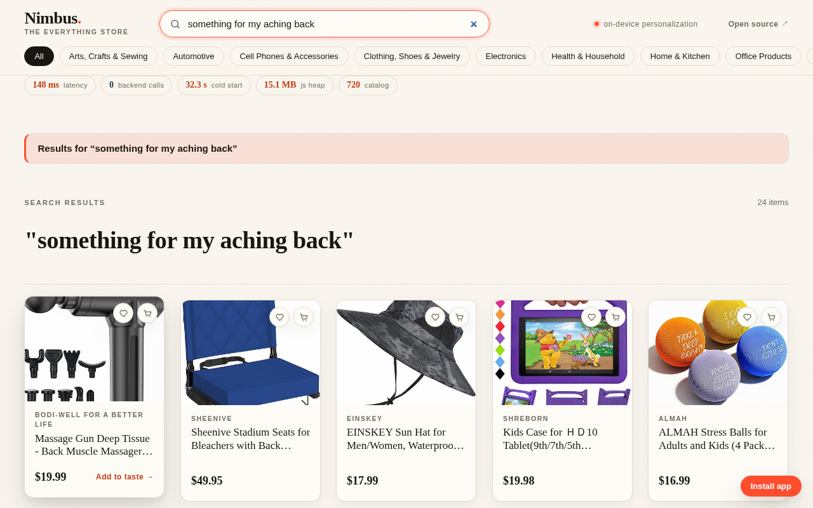

# EdgeReco

Search and product recommendations for small online stores, running in each shopper's browser instead of a paid server.

**[Try the demo store at edge-reco.com](https://edge-reco.com)**. Nothing to install.

[](https://github.com/hseshadr/edge-reco/actions/workflows/dagger.yml)
[](LICENSE)

Most online stores rent their search box and their "you might also like" rows from a
cloud service that charges per search. The bill grows with traffic, and you pay for
enough capacity to survive your busiest day. Many small stores skip it and live with a
plain keyword search, which misses what shoppers mean: type "something for my aching
back" and it happily returns a parking sign because the word "back" is in the title.

EdgeReco does the searching and ranking inside the shopper's browser tab. Your store
publishes one signed catalog file, about 1.5 MB for 720 products. The browser downloads
it once, checks the signature, and from then on searches by meaning as well as by words,
and re-ranks recommendations as the shopper clicks. No server answers the searches, so
the cost does not grow with traffic, and the store keeps working offline.

**Technical docs:** [Architecture](docs/ARCHITECTURE.md) · [Getting started for developers](docs/GETTING_STARTED.md) · [Python library and CLI](docs/USAGE.md) · [Security and privacy](docs/SECURITY-PRIVACY.md) · [Deploy](docs/DEPLOY.md)

## Try it

1. Open [edge-reco.com](https://edge-reco.com) and click **Launch the live demo**. This
   opens Nimbus, a pretend store with 720 real products. The first launch downloads the
   catalog and a small language model (about 46 MB in total), so give it a moment. Later
   visits start from the copy in your browser.
2. Type `something for my aching back` in the search box and press Enter.



The massage gun comes first even though you never typed "massage" or "muscle". The strip
under the search box shows `0 backend calls`: the search ran in your tab. Its other
numbers (search time, start-up time, memory) are measured live on your machine and vary.

3. Click the heart or the cart button on the massage gun. Scroll down to **Recommended
   for you**. The counter next to it goes to 1, then 2 signals, and the row re-orders
   toward the massage gun's category (Health & Household). Those signals are saved only in
   your browser. **Reset taste** clears them.

## How it works

The store builds its catalog once: the products, a prebuilt search index, and the
ranking weights. It signs that bundle with a private key. The shopper's browser downloads
the bundle, checks every piece against a public key built into the app, and refuses to
load anything that does not match. After that, each search runs a keyword match and a
meaning match side by side, merges the two lists, and re-orders the result using what
this shopper has clicked. An optional learning loop, off by default and off on the live
demo, can send anonymous grouped clicks to the store's own server so it can publish a
better-ranked catalog later.

EdgeReco is built on three sibling projects by the same author:

- [edgeproc-browser](https://github.com/hseshadr/edgeproc-browser) (`@edgeproc/browser`)
  does the download, signature check and offline storage in the browser.
- [edge-proc](https://github.com/hseshadr/edge-proc) does the same job for the optional
  Python side: it publishes and syncs the signed catalog, and searches it on a server.
- [edgeproc-core](https://github.com/hseshadr/edgeproc-core) is a small Python library
  edge-proc uses to organise its search index.

EdgeReco adds the store-specific part: the ranking formula, the shopper's session
signals and the demo store. [privacy-core](https://github.com/hseshadr/privacy-core) is
a separate, unrelated project (it hides personal data in AI prompts).

## What it does not do

- **Big catalogs.** It is built for thousands of products, not millions. Search is an
  exact scan with no approximate index, and the whole catalog is downloaded.
- **Private catalogs.** Every shopper gets the full catalog file, so anything in it is
  public.
- **Low-memory phones.** A first visit downloads about 46 MB and needs real memory. It
  has not been measured on physical phones yet.
- **A hosted service.** You build the catalog and host the static files yourself.
- **Merchandising tools.** There is no dashboard, A/B testing or manual boosting. Ranking
  is tuned by editing weights in the signed catalog.
- **Proof of each result.** The "why?" panel shows how a score was calculated and checks
  that the ranking settings were signed. It does not prove that a specific displayed
  result came from those settings.

## When to use something else

| If you need | Use |
| --- | --- |
| Millions of products, merchandising tools, and a vendor who runs it | A hosted search and recommendation service |
| Shoppers who search by exact product names only | Your store platform's built-in search |
| A catalog that must stay private | Your own search server behind an API |
| Thousands of products, flat cost, offline use, nothing to run per search | EdgeReco |

## Run it yourself

You need Node 24.16 (see [`frontend/.nvmrc`](frontend/.nvmrc)) and pnpm, which
`corepack` provides.

```bash
git clone https://github.com/hseshadr/edge-reco
cd edge-reco/frontend
corepack enable
pnpm install
pnpm -F frontend run build:pages
pnpm -F frontend exec vite preview
```

Open http://localhost:4173 and click **Launch the live demo**. On a fresh clone the
install took 12 seconds and the build 17 seconds. The build downloads the language model
and its runtime once and checks each against a pinned fingerprint.

The optional Python library, command line tool and API server need Python 3.13 and
[uv](https://docs.astral.sh/uv/). See [docs/USAGE.md](docs/USAGE.md).

## Develop

```bash
make gate
```

This runs the backend checks (`poe gate`) and the frontend checks (`pnpm gate`), the same
as CI. Allow about 8 minutes. [docs/GETTING_STARTED.md](docs/GETTING_STARTED.md) takes a
new developer from a fresh clone to a green build and a first change, including two
local traps to know about. Also see [CONTRIBUTING.md](CONTRIBUTING.md).

## More detail

- [Getting started for developers](docs/GETTING_STARTED.md): setup, the full check, a map
  of the code, and a first change.
- [Architecture](docs/ARCHITECTURE.md): the pieces, the scoring formula, how the browser
  and Python engines are kept in step, the security model, and what the tests prove.
- [Explore the interactive architecture map](docs/architecture/index.html): the runtime
  flow in an offline viewer.
- [Python library and CLI](docs/USAGE.md): run the same search in Python, tune the
  ranking weights, the learning loop, the command line, and configuration.
- [Quickstart](docs/QUICKSTART.md): the longer walkthrough, including `make demo` with
  Docker and building a catalog from your own CSV.
- [Deploy](docs/DEPLOY.md): hosting as static files, and the server-backed variant.
- [Security and privacy](docs/SECURITY-PRIVACY.md): the threat model and what data goes
  where. Report vulnerabilities as described in [SECURITY.md](SECURITY.md).
- [Dagger CI setup](docs/dagger-lego-adoption.md): how the CI pipeline is built and
  shared with other repositories.
- [CHANGELOG](CHANGELOG.md): what changed in each release.

## License

MIT. See [LICENSE](LICENSE). The demo products come from the Amazon Reviews 2023 dataset
(McAuley Lab, UC San Diego); attribution and the rights caveat are in [NOTICE](NOTICE).
