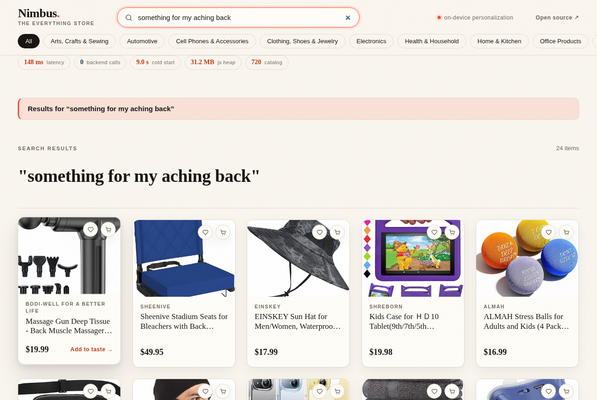
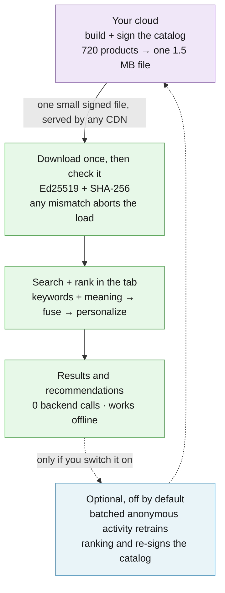

# EdgeReco

Search and product recommendations that run in the shopper's own browser, for online stores tired of paying per search.

[](https://github.com/hseshadr/edge-reco/actions/workflows/dagger.yml)
[](CHANGELOG.md)
[](LICENSE)

**[Live demo](https://edge-reco.com)** · [Docs](docs/ARCHITECTURE.md) · [Quickstart](docs/QUICKSTART.md)


<sub>Real output of the example below — the production build of the Nimbus demo store at http://localhost:4173 after searching "something for my aching back". The strip's speed and memory figures are measured live in your browser and differ by machine.</sub>

## At a glance

- **What it does** — Like the search box and "you might also like" rows on a big online store, but the matching and ranking run inside each shopper's browser instead of on a rented server. The store publishes one signed catalog file; the browser checks it, then searches by meaning (so "aching back" finds a massage gun) and re-ranks recommendations as the shopper clicks — with no further calls to a server.
- **Who it's for** — A small online store, or the developer building one, that pays a search service per query and wants search and recommendations whose cost doesn't grow with traffic. Nimbus, a pretend store with 720 real products, shows it working.
- **What stays on your device / what leaves it** — Stays: every search you type (processed in the tab, never saved), and your clicks, favorites, and cart-adds, kept as a small taste log in the browser's private storage until you press "Reset taste" or clear site data. Leaves: nothing about you in the default setup. The browser downloads the app, the 1.5 MB signed catalog, a 23 MB language model, and the 23 MB program that runs it — all from the store's own web address, never a third-party service. An optional learning loop, off by default, sends anonymous grouped clicks to the store's own server only if the store switches it on; the live demo keeps it off.
- **Runs on** — A current desktop browser (the automated browser tests use Chromium). A first launch downloads about 46 MB and needs real memory, so low-memory phones may struggle. After one online visit it installs like an app and keeps working with no network. The optional Python library and API server need Python 3.13+.
- **Not for** — A catalog of millions of products: it uses exact search built for thousands, with no approximate index yet. Not a hosted service: you deploy the static files yourself.
- **Status** — Beta: v0.12.0 is the latest tagged release (0.13.0 is written up in the CHANGELOG but not tagged yet); edge-reco.com deploys from `main`. See [CHANGELOG](CHANGELOG.md).

## Try it in 60 seconds

Fastest: open **[edge-reco.com](https://edge-reco.com)** — nothing to install. Click **Launch the live demo**.

To run your own copy (needs [Node 24.16](frontend/.nvmrc) and pnpm via `corepack`):

```bash
git clone https://github.com/hseshadr/edge-reco && cd edge-reco/frontend && corepack enable && pnpm install && pnpm -F frontend run build:pages && pnpm -F frontend exec vite preview
```

The first run takes a few minutes, not 60 seconds: it installs packages and downloads the
23 MB language model and its runtime once (each checked against a pinned fingerprint).
Then:

1. Open http://localhost:4173 and click **Launch the live demo**. The first launch loads the catalog and the model into your browser.
2. Type `something for my aching back` into **Search the everything store…** and press Enter.

What appears on screen (the hero above):

```text
0 backend calls · 720 catalog
Results for "something for my aching back" — 24 items
1. Massage Gun Deep Tissue - Back Muscle Massager w/High Torque Motor for Back Pain…   $19.99
2. Sheenive Stadium Seats for Bleachers with Back Support…                               $49.95
3. EINSKEY Sun Hat for Men/Women, Waterproof Wide Brim Bucket Hat…                       $17.99
```

You never typed "massage" or "muscle"; the massage gun comes first because the engine
matches meaning as well as words. The "backend calls" counter watches the page and both
of its background workers, and it stays at 0.

More runnable examples: the Python version of this search is in
[Usage & API](#usage--api), and [docs/QUICKSTART.md](docs/QUICKSTART.md) walks through the
full demo, including `make demo` (Docker) and the optional learning loop.

<!-- ======================== BELOW THE FOLD ======================== -->

## How it works

The store builds its catalog once — products, a prebuilt search index, and the ranking
weights — and signs it. A shopper's browser downloads that file one time, checks the
signature against a key built into the app, and refuses to load it if anything doesn't
match. From then on every search runs in the tab: a keyword match and a meaning match
run side by side, their rankings are merged, and the result is re-ranked for this
shopper from what they have clicked. Nothing goes back to a server unless the store
turns on the optional learning loop.


```mermaid
flowchart TB
  build["Your cloud<br>build + sign the catalog<br>720 products → one 1.5 MB file"]
  sync["Download once, then check it<br>Ed25519 + SHA-256<br>any mismatch aborts the load"]
  engine["Search + rank in the tab<br>keywords + meaning → fuse → personalize"]
  recs["Results and recommendations<br>0 backend calls · works offline"]
  learn["Optional, off by default<br>batched anonymous activity retrains<br>ranking and re-signs the catalog"]

  build -->|"one small signed file, served by any CDN"| sync
  sync --> engine --> recs
  recs -.->|"only if you switch it on"| learn
  learn -.-> build

  classDef cloud fill:#f0e8f8,stroke:#9472b0,color:#171717;
  classDef device fill:#e8f8e8,stroke:#5fa85f,color:#171717;
  classDef opt fill:#e8f4f8,stroke:#5b9bbf,color:#171717;
  class build cloud;
  class sync,engine,recs device;
  class learn opt;
```

Everything in green happens on the shopper's own device. Your cloud is touched
only to publish a new catalog — never to answer a search.

**[Explore the interactive architecture map →](docs/architecture/index.html)**
(Archify, generated from [`docs/architecture/runtime.architecture.json`](docs/architecture/runtime.architecture.json)).
Deep dive: [docs/ARCHITECTURE.md](docs/ARCHITECTURE.md).

- **origin** — serves a *signed, content-addressed bundle*. A **bundle** is the one file-set your store hands out: the products, the prebuilt search index, and the ranking weights. *Content-addressed* means every piece is named by the hash of its own bytes, so it can be cached forever and can't be tampered with undetectably. It's structured as a `latest` version pointer plus immutable `manifest/<hash>` and `chunk/<hash>` objects. A committed 720-product bundle lives in `backend/examples/catalog/` (1.5 MB on disk).
- **edge** — a Caddy reverse proxy (a small static web server standing in for a CDN) applying the cache policy: immutable chunks cached forever, short-lived pointer.
- **browser tier** — the Nimbus single-page app **syncs** the bundle — *sync* meaning: fetch it, check its signature, and store it locally — into **OPFS** (Origin Private File System: a private, per-site sandboxed disk the browser gives each website). It verifies with Ed25519 signatures + SHA-256 checksums *fail-closed* (any mismatch aborts the load) against a key baked into the app build, loads the `all-MiniLM-L6-v2` model, and runs the full pipeline **in the tab**. No application server in the request path.
- **edgereco runtime (Python)** — the same engine packaged as a FastAPI app for the server-side case. Same scoring formula, same sync + verify, same prebuilt index — the in-browser engine is tested for parity against it.

### The layers

EdgeReco is two layers, not one.

The bottom layer is [**edge-proc**](https://github.com/hseshadr/edge-proc) — a reusable local-compute engine: signed catalog delivery, an on-device cache, fail-closed verification, and the retrieval primitives. The top layer is **edge-reco** — the product-discovery brain: the scoring formula, the session-signal capture, and the session-aware re-ranker.

That split is real in both runtimes. The Python side depends on [`edge-proc[localvec,bundles]`](backend/pyproject.toml). The browser side depends on the standalone [`@edgeproc/browser`](https://github.com/hseshadr/edgeproc-browser) package for signed sync, integrity, Workers, OPFS, and vector contracts, while this repo's [`@edgereco/browser`](frontend/packages/edgereco-browser/) package owns only recommendation-specific embedding, search, ranking, and session logic. The lower layer is reusable for any local browser workload; EdgeReco turns it into recommendations, and the two halves are tested against each other to return identical results.

| Repo | Role |
| --- | --- |
| [**edge-reco**](https://github.com/hseshadr/edge-reco) (this repo) | the product brain — scoring formula, session signals, session-aware re-ranker, the Nimbus demo storefront. |
| [**edge-proc**](https://github.com/hseshadr/edge-proc) | the reusable local-compute layer — signed catalog delivery, on-device content-addressed cache, fail-closed Ed25519 + SHA-256 verification, and the retrieval primitives. **This is what makes on-device search possible.** |
| [**edgeproc-browser**](https://github.com/hseshadr/edgeproc-browser) | the reusable browser Lego — signed bundle sync, OPFS/CAS, Worker transport, integrity checks, and swappable vector indexes. |
| [**edgeproc-core**](https://github.com/hseshadr/edgeproc-core) | the vector-partitioning protocol edge-proc builds its local vector index on. On PyPI as [`edgeproc-core`](https://pypi.org/project/edgeproc-core/). |

You don't need to clone edge-proc or edgeproc-core — the backend pulls edgeproc-core from PyPI and edge-proc from public GitHub automatically (see [QUICKSTART](docs/QUICKSTART.md)).

## What you can do

- Search a catalog by meaning and by keyword, merged into one ranking — [Hybrid search](#hybrid-search)
- Re-rank "Recommended for you" live from clicks, favorites, and cart-adds, on the device — [Session-aware re-ranking](#session-aware-re-ranking)
- Show seven recommendation rails: trending, new arrivals, similar items, because you viewed, customers also bought, frequently bought together, for you — [Ranking is data, not code](#ranking-is-data-not-code)
- Retune ranking by republishing data, with no code change — [Ranking is data, not code](#ranking-is-data-not-code)
- Keep working offline after one visit, and install like an app — [Works offline](#works-offline-installs-like-an-app)
- See why a result ranks where it does: every signal, weight, and contribution — [Honest limits](#limitations--roadmap)
- Optionally learn from anonymous activity and republish a better catalog — [The learning loop](#the-learning-loop)
- Run the same engine as a Python library or an API server — [Server-side variant](#server-side-variant--publish--sync--serve), [CLI](#cli)
- Host the whole store as static files on any CDN — [docs/DEPLOY.md](docs/DEPLOY.md)

## Why this and not X

| Option | Where it is the better choice | What you give up |
| --- | --- | --- |
| **A hosted search/recommendation service** (pay per query) | Huge catalogs, merchandising dashboards, A/B testing, and a vendor who runs it | Cost that grows with traffic, and every keystroke crosses the network |
| **Your platform's built-in keyword search** | Shoppers search by exact product names | Meaning: "aching back" returns a parking sign (see [the shopping trip](#the-problem-in-one-shopping-trip)) |
| **Your own search server** (e.g. a vector database behind an API) | Millions of products, or data that must never ship to the browser | A server to run, scale, and pay for on the busiest day |
| **EdgeReco** | Thousands of products, cost that doesn't grow with traffic, and offline use | A one-time download on first visit, and the whole catalog is public |

## Security and trust model

- **Verified:** the catalog's `latest` pointer, manifest, and every chunk — Ed25519
  signature and SHA-256 hashes — against the public key built into the app
  (`frontend/app/public/public.key`), never a key carried in the catalog. The ranking
  "why?" panel separately checks a signed ranking proof against the same trust root. The
  23 MB model and its runtime are pinned by SHA-256 at build time.
- **Refuses rather than warns:** a bad signature, hash mismatch, truncated chunk, or an
  older release than one already seen (rollback) aborts the load and shows a sync
  failure; nothing falls back to unverified data. A stuck returning shopper gets an
  explicit **Clear cached catalog and retry** — it never clears on its own.
- **Not protected:** a compromised app origin (it could replace both the code and the
  key), a compromised device or browser extension, or someone with access to the
  browser profile (the catalog is public and the taste log is readable locally). The
  model files are pinned but not covered by the catalog signature. A key revocation
  reaches a returning shopper one page load late — see
  [DEPLOY.md](docs/DEPLOY.md#revocation-lag-the-service-worker-serves-the-trust-root-from-its-precache).
- **Verify a release:** [`edge-reco.com/build.json`](https://edge-reco.com/build.json)
  names the exact deployed commit, version, and catalog bundle; the Python example in
  [Usage & API](#usage--api) syncs and verifies the committed catalog against
  `backend/examples/keys/public.key`.

Full threat model and data inventory: [docs/SECURITY-PRIVACY.md](docs/SECURITY-PRIVACY.md).
See [SECURITY.md](SECURITY.md) for reporting a vulnerability.

## What this proves / what it does not prove

| Claim | Backed by |
| --- | --- |
| Zero backend calls after sync, and no third-party CDN at runtime | `pnpm -F frontend run test:e2e:offline` (incl. `cold-blocked.spec.ts`, which boots the store with every external CDN blocked) |
| Works offline after one visit, including on the real host's rules | `test:e2e:offline` (`offline.spec.ts`, `pages-advanced-mode.spec.ts`) |
| A tampered catalog is refused in a real browser | `test:e2e:c1` (`sync.spec.ts`) |
| The browser engine returns the same results as the Python engine | parity fixtures under `frontend/packages/edgereco-browser/src/engine/__fixtures__/` and their tests |
| Cold start, search speed, and memory stay inside release budgets | `test:e2e:c1` prints them for your machine and enforces the budgets; this README deliberately states no timings |
| The hero above is real | captured from `pnpm -F frontend run build:pages` + `vite preview`, launching the demo and searching the query above |
| This README's first screen keeps its shape | [`backend/tests/unit/test_readme_contract.py`](backend/tests/unit/test_readme_contract.py) |

It does **not** prove: recommendation quality for your store or shoppers, behaviour on a
particular low-memory phone (no physical-device measurements yet), or that a displayed
result was computed from the signed ranking config — the ranking proof attests which
config and formula shipped, not each result.

## Install

### Running it locally

`make demo` (below) is the path with the toolchain installed. Without one, you need this repo and Docker. Nothing else.

```bash
cd frontend && docker compose up --build

# then visit http://localhost:5174 in your browser
```

You'll land on a short intro page — hit **"Launch the live demo"** and the engine boots right in your tab (a brief loading screen while it fetches the catalog and a small AI model), then the storefront appears.

Search for "shirt", then click a couple of products. Every click reshapes the "Recommended for you" rail across five taste signals — category, brand, tags, popularity, and freshness — re-ranking instantly, on-device, with no trip to a server. Hearts and cart-adds count more than clicks; what you linger on nudges things gently. The home page also stacks *Trending* and *New arrivals*; open any product for *Similar items*, *Because you viewed*, *Customers also bought*, and *Frequently bought together*.

After one successful online launch, use the browser's offline mode and reload. Search and recommendations continue from local caches.

> _What that one-time download fetches:_ the signed catalog file, the `all-MiniLM-L6-v2` language model (~23 MB), and the runtime that executes it (~23 MB) — **all from the demo's own web address**, never a third-party CDN. Both are copied in at build time and pinned to their exact content hashes; an automated browser test boots the store with every external CDN blocked to prove it.

**Working on the code?** With the toolchain installed (uv + Node + pnpm + Docker), `make demo` (or `poe demo`) from the repo root does the same thing in one command and opens your browser. It picks **free ports per run**, so it never clashes with a stale container or another project. (`cd backend && uv run poe demo` works too, e.g. without a global poe install; `make demo` falls back to it automatically.)

Full walkthrough, including the backend gate: [docs/QUICKSTART.md](docs/QUICKSTART.md).

## Usage & API

### The problem, in one shopping trip

You're on a store's website. Your back hurts. You type **"something for my aching back"** into the search box.

An ordinary search box matches *words*. Your words are "something", "for", "my", "aching", "back" — so it hunts for products with those words in the title and hands you whatever it finds. Here is what that actually returns from a real 720-product catalog:

```
Reserved Parking Sign, Custom Parking Signs for Business
Massage Gun Deep Tissue - Back Muscle Massager
Don't Kill My Vibe Neon Sign
```

A parking sign. Because the word "back" showed up somewhere and the word-matcher has no idea what you *meant*.

EdgeReco runs the word match **and** a meaning match, then merges them:

```
Massage Gun Deep Tissue - Back Muscle Massager
Silicone Earring Backs for Studs
Sheenive Stadium Seats for Bleachers with Back Support
```

The massage gun is now first. You never typed "massage" or "muscle". The engine understood the request.

That output is real — [run it yourself in about ten lines of Python](#see-it-yourself-in-python).

### The part that's actually unusual

That entire search ran **on the shopper's device**. Not on a server. Not in a cloud API. In the browser tab.

Most stores rent search and recommendations from a cloud service and pay per query. Every shopper's every keystroke crosses the network and costs money. To survive Black Friday you rent far more capacity than you need the other 364 days — and the smartest part of the store is also the most expensive one, and the first to fall over when traffic spikes.

**EdgeReco flips that.** Your store sends each shopper's browser one small file — your products plus the logic that ranks them — exactly once. After that, search, ranking, and personalization all run locally, with nothing sent back to a server.

So every shopper brings their own hardware. The more popular you get, the more capacity you have. Your bill stops growing with traffic and drops to the cost of handing out one small file. Results come back instantly, and keep coming back when the connection drops.

**And it still gets smarter.** An optional loop — off by default — lets your store learn from anonymous, grouped shopper activity in the cloud, then hand every device an updated file to pick up on its next visit. The shopping always runs on the device; only the learning is optional, and even that never touches a live shopper's results.

### Nimbus is the proof

Nimbus is a pretend storefront built on 720 real products so you can watch this happen: search, click a few items, and see the recommendations re-rank — while the **"backend calls" counter sits at 0**. That's the screenshot at the top of this page.

The metrics strip reports search latency and memory alongside the backend-call count, measured in your own browser as you browse. Reproduce the release measurement with `cd frontend && pnpm -F frontend run test:e2e:c1`; it prints cold start, search p50/p95, and Chromium heap for that machine. CI enforces numerical release budgets in that test instead of copying a measurement into this README.

> _Nimbus is fictional — built only to demo EdgeReco. It is not a real shop. Its products come from a public Amazon research dataset — see [Data & attribution](#data--attribution)._

**What's actually deployed right now:** [`edge-reco.com/build.json`](https://edge-reco.com/build.json) is generated at deploy time and names the exact commit, version, and catalog bundle currently live. It is always current, which is why this README doesn't pin a commit.

### See it yourself, in Python

The same engine also runs as a plain Python library — same catalog file, same ranking, no browser. This is the script that produced the search output at the top of this README:

```python
# Save as backend/demo.py, then:
#   cd backend && uv sync --group dev && uv run python demo.py
from pathlib import Path
from edgeproc.bundles.signing import Ed25519Verifier
from edgereco.api.deps import ServiceContainer
from edgereco.search.hybrid import reciprocal_rank_fusion

# Sync the committed signed catalog, verify it, and load the engine locally.
engine = ServiceContainer.from_synced(
    base_url=str(Path("examples/catalog").resolve()),
    cache_root=Path("/tmp/edgereco-cache"),
    verifier=Ed25519Verifier.from_public_bytes(
        Path("examples/keys/public.key").read_bytes()
    ),
)

query = "something for my aching back"
keyword = engine.keyword.search(query, k=30)                             # word matching
vector = engine.vector.search(engine.encoder.encode_query(query), k=30)  # meaning matching

print("keyword only:")
for pid, _ in keyword[:3]:
    print("   ", engine.by_id[pid].title[:60])

print("keyword + meaning, fused:")
for pid, _ in reciprocal_rank_fusion(keyword, vector)[:3]:
    print("   ", engine.by_id[pid].title[:60])
```

Real output:

```
keyword only:
    Reserved Parking Sign, Custom Parking Signs for Business,10x
    Massage Gun Deep Tissue - Back Muscle Massager w/High Torque
    Don't Kill My Vibe Neon Sign Vibe Led Sign Pink And White Ne
keyword + meaning, fused:
    Massage Gun Deep Tissue - Back Muscle Massager w/High Torque
    Silicone Earring Backs for Studs 6 Styles Clear Hypoallergen
    Sheenive Stadium Seats for Bleachers with Back Support, Blea
```

The first run downloads the language model, so it takes a minute; after that it's local.

### Hybrid search

Two retrieval methods run in parallel and get merged.

**BM25** is the classic keyword-relevance score — it ranks documents by how well their words match the query's words. It catches exact matches and is why "Bose QuietComfort Earbuds" comes back for "earbuds".

**Vector search** catches meaning. Each product title is turned into an **embedding** — a list of numbers positioning that text in a space where similar meanings sit close together. The query gets the same treatment. The Python runtime searches with **FAISS**; the browser imports the authenticated embedding matrix into **SQLite + sqlite-vector**, running in a dedicated Worker with its database persisted in OPFS. This is why "aching back" reaches a massage gun, and "earbuds" reaches "wireless headphones" without keeping a second in-memory vector index in the tab. Both tiers use exact flat search (FAISS `IndexFlatIP` / sqlite-vector full scan); that is fine at demo scale (720 products), and there is no ANN index yet.

The two rankings are fused with **RRF** (Reciprocal Rank Fusion) — a simple, tuning-free way to merge two ranked lists by position rather than by score, so neither method's scoring scale can dominate the other:

```
rrf_score = Σ 1/(k + rank_i)   summed over each method's rank for an item
```

### Session-aware re-ranking

**Re-ranking** means: take the search results, then reorder them for *this* shopper. Every interaction bumps a per-session affinity for the product's category, tags, and brand, by a weight that scales with how much intent it shows:

| event | category | tag | brand |
|---|---|---|---|
| view | +0.02 | +0.01 | +0.02 |
| click | +0.10 | +0.05 | +0.08 |
| favorite | +0.20 | +0.10 | +0.15 |
| cart | +0.25 | +0.12 | +0.20 |

Affinities clamp at 1.0; the last 50 viewed product IDs carry a repetition penalty so the rail keeps surfacing new things. The re-ranker rescores the candidates against that live profile:

```
score = retrieval
      + popularity_weight·popularity
      + category_weight·category_aff
      + tag_weight·tag_aff
      + brand_weight·brand_aff
      + freshness_weight·freshness
      + similarity_weight·similarity
      + cooccurrence_weight·cooccurrence
      − repetition_penalty_weight·was_recently_viewed
```

Assay executes those nine terms in that exact left-to-right binary64 order; the seven positive ranking signals are strategy-weighted, retrieval has coefficient 1, and repetition is the only subtraction. This loop is **zero-network**: a click folds straight into the browser-local profile and the rail reorders on the spot — no fetch, no round trip. The activity log is durable in this browser until “Reset taste” clears it.

### Ranking is data, not code

Those weights aren't compiled in. They ride inside the signed bundle as `ranking_config.json`, alongside the "also bought" map (`cooccurrence.json`). **Retuning ranking is a data republish — no code change, no redeploy** — and both the Python and browser halves pick it up on their next sync.

The Python types are `RankingConfig` and `DEFAULT_RANKING_CONFIG`. They are not re-exported from any `__init__.py`, so import them from their module directly:

```python
from edgereco.reco.ranking_config import RankingConfig, DEFAULT_RANKING_CONFIG

w = DEFAULT_RANKING_CONFIG.scoring_weights
print("popularity", w.popularity, "| category", w.category, "| tag", w.tag)
print("brand", w.brand, "| freshness", w.freshness, "| repetition", w.repetition_penalty)
print("strategies:", ", ".join(sorted(DEFAULT_RANKING_CONFIG.strategies)))

# Retune: a store that wants brand loyalty over raw popularity.
tuned = DEFAULT_RANKING_CONFIG.model_copy(
    update={"scoring_weights": w.model_copy(update={"brand": 0.30, "popularity": 0.20})}
)
print("tuned brand:", tuned.scoring_weights.brand)
print("valid config:", isinstance(tuned, RankingConfig))
```

Real output:

```
popularity 0.4 | category 0.2 | tag 0.15
brand 0.1 | freshness 0.1 | repetition 0.25
strategies: also_bought, because_viewed, for_you, frequently_bought_together, new_arrivals, similar_items, trending
tuned brand: 0.3
valid config: True
```

`RankingConfig` carries four fields: `scoring_weights: ScoringWeights`, `interaction_weights: InteractionWeights`, `schema_version: int` (currently 3), and `strategies: dict[str, Strategy]` — the seven named strategies above, one per rail on the storefront.

`ScoringWeights` requires `popularity`, `category`, `tag`, `brand`, `freshness`, and `repetition_penalty`, and defaults `similarity` and `cooccurrence` to `0.0` so an older bundle reduces to the original formula exactly. Every weight is constrained `>= 0`, so an illegal weight in a signed config fails validation rather than silently ranking badly:

```
ValidationError: Input should be greater than or equal to 0
  [type=greater_than_equal, input_value=-1.0, input_type=float]
```

### The learning loop

`make demo` makes **zero** backend calls — that's the default. Two extra commands show the optional loop that lets the store improve:

**1. Send activity up.** `poe demo-flywheel` adds a pretend cloud collector and shows the uplink half: clicks are captured in-tab and periodically flushed (batched, fire-and-forget) so the cloud can retrain. Signals are graded by intent — a cart-add weighs 4×, a favorite 3×, a click 1×, a lingered view 0.2× (the same grading both halves use in-session). Search and ranking still run 100% locally; the uplink is optional and off by default. Watch the `POST /events` requests and the "N interactions synced to cloud" badge.

**2. Learn and republish.** `poe demo-retrain` is the cloud half — it recomputes each product's popularity from the collected events **and** the "customers also bought" map from the session log, then republishes a freshly signed catalog file. Refresh the page and the rails re-rank toward what you clicked, because both halves re-read the new numbers from that one signed file — *no scoring-formula change, no re-computing the language model*.

That's the whole loop: **click → cloud → retrain → better recommendations.** (Re-signing needs the maintainer's private key, so step 2 is for repo owners; the published demo ships the result.)

Want to see what a retrain *would* do before doing it? `edgereco audit ORIGIN VERIFY_KEY --sessions LOG` is read-only: it prints the event counts, the top popularity movers, and the changed "also bought" edges behind the next update. It never signs, never publishes, and never touches the search path.

### Works offline, installs like an app

Nimbus is also a **PWA** (Progressive Web App — a website your browser can install like a native app). Where supported you'll get an "Add to Home Screen" prompt, and it opens in its own window.

More importantly: **after the first visit it keeps working with no network at all.** A service worker (the browser's background cache manager) precaches the app shell on first load; the language model and its runtime survive offline in the browser's own caches. The signed catalog is already stored on your device — and the service worker deliberately never touches it, so its signature guarantees are unchanged.

Product photos are copied into the build and served from the demo's own address (`/images/`), so browsing never tells an image CDN what you looked at. They are not precached, so offline a photo shows only if your browser still has it cached. Search, browse, and every recommendation rail work without a connection.

Prove it yourself:

```bash
pnpm -F frontend test:e2e:offline
```

That test warms the app online, cuts the network, reloads, and asserts the store still mounts and ranks. A second production-shaped test serves the build with Cloudflare Pages' reserved files withheld; this catches a missing service worker that a plain local file server cannot see.

### Delivery and updates

The whole engine ships as **static files on a CDN** — the app code, plus the signed bundle holding the products, the *prebuilt* vector index, the ranking weights, and the "also bought" map. The live demo serves all of it from Cloudflare Pages, same-origin; any static host works. On first load the browser syncs the bundle into OPFS, verifies it fail-closed, and from then on runs locally.

**Updates are a patch, not a re-download.** Because every piece is named by the hash of its bytes, publishing a new bundle lets the client compare the new manifest against what's already on the device and fetch **only the pieces that changed** — reusing everything else, notably the large vector index. A retrain that only moves popularity scores and "also bought" edges re-fetches a few small pieces; the rest is a cache hit. As [DEPLOY.md](docs/DEPLOY.md) puts it: *"a one-line edit re-publishes one chunk; every consumer fetches one chunk and reuses the rest."*

### Server-side variant — publish → sync → serve

For the **optional** server-side API (the FastAPI runtime, not used by the browser demo above), reproduce the delivery loop with the CLI:

```bash
cd backend
uv sync --group dev

# 1. build a products.jsonl from a scraped-Amazon CSV
uv run edgereco build-catalog products.csv /tmp/staging/products.jsonl

# 2. build the vector index into the staging dir (the build machine may fetch the
#    embedding model; edge-proc refuses to unless told, or use EDGEPROC_MODEL_PATH)
EDGEPROC_ALLOW_MODEL_DOWNLOAD=1 uv run edgereco index /tmp/staging /tmp/staging

# 3. sign + publish a content-addressed bundle origin
uv run edgereco bundle /tmp/staging /tmp/origin examples/keys/private.key \
    --catalog-id amazon-demo --version v1 --product-count 720

# 4. serve by syncing that origin (a filesystem path works too) + verifying the key
EDGERECO_BUNDLE_BASE_URL=/tmp/origin \
EDGERECO_VERIFY_KEY_PATH=examples/keys/public.key \
EDGERECO_BUNDLE_CACHE_DIR=/tmp/bundle-cache \
EDGEPROC_ALLOW_MODEL_DOWNLOAD=1 \
    uv run edgereco serve /tmp/staging /tmp/staging --port 8000
```

The committed `backend/examples/catalog/` is exactly such an origin, so step 4 alone — pointed at it — serves the demo data.

### CLI

```
edgereco build-catalog INPUT.csv OUTPUT.jsonl           # scraped-Amazon CSV -> products.jsonl
edgereco preprocess INPUT.csv OUTPUT_DIR [--limit N]    # Kaggle-schema CSV -> jsonl + manifest
edgereco index STAGING_DIR INDEX_DIR                    # build the vector/ index
edgereco bundle STAGING_DIR ORIGIN_DIR PRIVATE_KEY [--sequence N]  # sign + publish; N defaults to latest+1
edgereco serve CACHE_DIR INDEX_DIR [--host HOST] [--port PORT]
    # with EDGERECO_BUNDLE_BASE_URL + EDGERECO_VERIFY_KEY_PATH set, syncs + verifies a
    # signed bundle from that origin instead of reading the flat CACHE_DIR/INDEX_DIR.
edgereco search QUERY CACHE_DIR INDEX_DIR [--limit N] [--category CAT] [--json]
    # reads a flat preprocess-style dir (products.jsonl + manifest.json + vector/).
    # To search a signed bundle, sync it first — see the Python example above.
edgereco retrain BUNDLE_BASE_URL ORIGIN_DIR PRIVATE_KEY VERIFY_KEY
    # the cloud half of the loop: sync, recompute popularity (from the collector's
    # --events-url) + co-occurrence (from a --sessions JSONL log), re-sign, republish.
    # Pure data transform — the scoring formula never changes.
    [--events-url URL] [--sessions LOG.jsonl] [--alpha 0.5] [--version V]
edgereco audit BUNDLE_BASE_URL VERIFY_KEY [--sessions LOG.jsonl] [--alpha 0.5]
    # read-only preview of what a retrain would change. Never signs or publishes.
```

## Configuration

Both halves run on safe defaults — config is opt-in. To see the full surface, copy the example files (nothing in them is a secret):

```bash
cp backend/.env.example backend/.env     # EDGERECO_* recommender + DEMO_* API vars
cp frontend/.env.example frontend/.env   # VITE_BUNDLE_BASE_URL + test tooling
```

Vite auto-loads `frontend/.env`. The backend's `EDGERECO_*` vars are read from the process environment, so export them first (`set -a && source .env && set +a`) or pass them inline as in the publish→sync→serve steps above.

The knobs that change what a shopper's browser does (build-time Vite variables):

| Variable | Default | What it changes |
| --- | --- | --- |
| `VITE_BUNDLE_BASE_URL` | `bundle` in the static build (same-origin) | Where the signed catalog is fetched from. The public key is always read from the app's own origin, never from here. |
| `VITE_BUNDLE_ID` / `VITE_BUNDLE_CHANNEL` | `amazon-demo` / `stable` | The catalog identity the browser expects; keep them stable, or returning shoppers refuse the new release. |
| `VITE_EVENTS_URL` | unset (learning loop off) | Where the optional learning loop sends batched clicks. Unset means no uplink at all. |
| `VITE_BASE` | `/` | The path the app is served under (e.g. `/<repo>/` on a GitHub Pages project site). |

Server-side secrets never go in these files' committed copies: the signing key
(`backend/examples/keys/private.key`) is gitignored, and the collector token is set with
`EDGERECO_EVENTS_TOKEN` in the environment. The recommender's `EDGERECO_*` settings
(model, `EDGERECO_RRF_K`, search limit, bundle URL and verify key) are listed in
[`backend/.env.example`](backend/.env.example).

## Limitations & roadmap

**Shipped** (v0.12.0, plus 0.13.0 and the Unreleased changes deployed from `main` — see
[CHANGELOG](CHANGELOG.md)): signed catalog sync with fail-closed checks, hybrid search,
session-aware re-ranking, seven recommendation rails, offline use after one visit, the
ranking "why?" panel, the optional learning loop, and the Python library/API server.

**Known limits** — things this project does **not** do, stated plainly:

**Resource floor.** A first launch downloads a roughly 23 MB quantized language model and a roughly 23 MB ONNX/WASM runtime, then allocates more memory while compiling and running them. The engine starts only after the shopper clicks Launch; simultaneous first searches share one model load, failed boots release both Workers, and the release test enforces cold-start, search, and Chromium-heap budgets. This is still a meaningful cost on low-memory phones and laptops. The app does not claim support for a particular minimum-memory device until physical-device measurements establish one.

**1. Bundle-sync verification is not displayed.** Signature checking genuinely runs, fail-closed, every time the catalog syncs — a tampered file *is* rejected and the app *does* refuse to load it. That reusable implementation comes from the standalone [`@edgeproc/browser`](https://github.com/hseshadr/edgeproc-browser) dependency; EdgeReco does not keep a private copy. What does not exist is a screen showing that bundle-sync outcome. The landing page's “verify (Ed25519 + SHA-256, fail-closed)” step is static pipeline copy, not a live result. The separate ranking-proof evidence below does not replace or claim to display bundle-sync verification.

**2. Ranking proof is deliberately narrower than result truth.** The “why?” panel has two sibling sections. **How calculated — Assay** shows the live ordered formula for that result: every raw signal, coefficient, additive/subtractive contribution, and final score. **Config provenance — Avow** reports whether the publisher signature on a static `edgereco.ranking-proof/v1` payload verifies, its hash matches the complete `ranking_config.json`, and its formula probes — one fixed synthetic input per strategy, plus search — reproduce their signed outputs. That attests which config and formula shipped; it does not attest that any displayed result was computed from them. It never signs a shopper’s personalized result, and it does not prove input truth, freshness, fairness, or recommendation quality.

The currently committed catalog carries the older receipt shape. The browser labels that receipt **unavailable**, never verified. A v1 proof appears only after an authorized catalog republish with the maintainer signing key; this repository change does not silently republish or deploy catalog data.

**3. The language model is not inside the signed catalog file.** It ships as ordinary same-origin static files instead — the build copies the model into `/models/` and its runtime into `/ort/`, each pinned to its exact content hash, so a first visit fetches everything from the app's own web address and no third-party CDN. But those files are not covered by the catalog's signature. The catalog format is just content-addressed bytes, so it *could* carry the model, signed and patched like the products; folding it in is a natural next step.

**4. There is no origin→device handoff yet.** Because the same engine runs on both sides, a deployment *could* serve recommendations from a server while the device downloads its copy in the background, then switch over silently — erasing the initial wait entirely. The foundations exist (both halves are tested to agree, a clean seam, incremental updates), but the automatic handoff is **not wired**. Today the browser boot is a blocking gate and the two shapes are separate deployment choices.

**Planned (not shipped):** folding the language model into the signed catalog, an
automatic origin-to-device handoff, and an approximate index for large catalogs are
ideas described above, not scheduled work.

## Getting help

- **GitHub Issues** — Best for: bugs and concrete feature requests.
- **Email (private)** — Best for: security reports; see [SECURITY.md](SECURITY.md). Never open a public issue for a vulnerability.

## Contributing / development

```bash
make gate
```

`make gate` runs the backend `poe gate` and the frontend `pnpm gate` — the same commands
CI runs through Dagger.

### Development commands

```bash
dagger check                      # canonical full gate: same graph locally and on GitHub
dagger check backend-quality      # run one independently cached contract
dagger check -l                   # list the composable quality/security contracts
dagger call build --commit-sha "$(git rev-parse HEAD)" export --path /tmp/edge-reco-dist
dagger call release-preflight --commit-sha "$(git rev-parse HEAD)" # pinned Wrangler, no creds

make gate                         # direct host-toolchain gate

# Backend (Python recommender)
cd backend
uv sync --group dev
uv run poe gate                   # format + lint + types + complexity + tests/coverage
uv run poe audit                  # dependency vulnerability scan (network; own workflow)

# Frontend (Nimbus storefront + @edgereco/browser over @edgeproc/browser)
cd ../frontend
pnpm install                      # resolves the exact pinned @edgeproc/browser Git commit
pnpm -r run lint                  # biome on both workspace members
pnpm -r run typecheck             # tsc -b on both
pnpm -r run test                  # vitest on both
pnpm -F frontend run build        # prove the workspace link resolves
```

The repo follows strict test-first development: unit tests in `backend/tests/unit/`, behaviour scenarios in `backend/features/` with steps in `backend/tests/bdd/`, integration tests in `backend/tests/integration/`, end-to-end in `backend/tests/e2e/`.

Dagger owns the complete repository-authored release graph. EdgeReco keeps its product
build, audits, CodeQL, parity, browser journeys, signed bundle/model identity, and live
zero-egress proof. Exact-SHA modules in `hseshadr/ci` own the common repository guard,
artifact envelope, exact-green evidence, and Cloudflare Pages delivery. GitHub workflows
only check out the source, select the protected `production` environment for deployment,
and call the pinned Dagger engine. EdgeReco is the first graduated consumer; see the
[Dagger lego adoption evidence](docs/dagger-lego-adoption.md) before applying the pattern
to another repository. GitHub CodeQL Default Setup remains enabled
until the Dagger SARIF check is green on hosted pull requests and its upload replacement
can be cut over without a coverage gap.

See [CONTRIBUTING.md](CONTRIBUTING.md).

### Data & attribution

This demo ships **two different catalogs** — don't confuse them:

| Catalog | Path | What it is |
| --- | --- | --- |
| **Demo data (the headline)** | `backend/examples/catalog/` | A committed, signed 720-product bundle of **real Amazon products**, balanced across **12 categories** (60 each) so session-aware re-ranking visibly personalizes. This is what Nimbus and the offline demo use. |
| Synthetic API fixture | `backend/demo_server/catalog/products.jsonl` | 300 **fabricated** products with made-up brands, used only by the optional FastAPI server. Not real data. |

The committed 720-product bundle is a balanced, curated subset of the **Amazon Reviews 2023** dataset (item metadata) by the McAuley Lab at UC San Diego ([amazon-reviews-2023.github.io](https://amazon-reviews-2023.github.io/), released for research use; cite Hou et al., *arXiv:2403.03952*). It is produced by `scripts/curate_demo_catalog.py` → `edgereco build-catalog` → `edgereco index` → `edgereco bundle`; you can regenerate it with the same commands.

This attribution is *not* a license to the underlying content: the product listings, titles, and images originate from Amazon.com and remain subject to Amazon's terms. See [`NOTICE`](NOTICE) for the full attribution and the rights caveat — and verify your rights before redistributing.

### Docs

- [Interactive architecture map](docs/architecture/index.html) — evidence-linked runtime
  flow in a fully offline viewer.
- [`docs/ARCHITECTURE.md`](docs/ARCHITECTURE.md) — architecture, system context, request lifecycle (with diagrams).
- [`docs/QUICKSTART.md`](docs/QUICKSTART.md) — clone → backend gate → frontend test → run the demo end to end.
- [`docs/DEPLOY.md`](docs/DEPLOY.md) — backend-free vs edge-origin deployment patterns.
- [`docs/SECURITY-PRIVACY.md`](docs/SECURITY-PRIVACY.md) — threat model, privacy/egress inventory, retention, operator requirements.
- [`docs/dagger-lego-adoption.md`](docs/dagger-lego-adoption.md) — reusable Dagger ownership, runnable proof, canary evidence, and current secret-boundary limitation.

Every diagram in this repo is an inline Mermaid fence — no build step, no committed
image that can drift from the text beside it.

### Repo layout

- `.github/` — exact-head CI, security scans, and serialized Cloudflare deployment.
- `backend/` — Python project root (`pyproject.toml`, `uv.lock`).
  - `backend/src/edgereco/` — runtime: `catalog/` `embeddings/` `search/` `reco/` `edge/` `telemetry/` `api/` `cli.py` `config.py`
  - `backend/features/` — Gherkin behaviour specs, decoupled from step implementations
  - `backend/tests/` — `unit/` `bdd/` `integration/` `e2e/`
  - `backend/deploy/` — `Dockerfile`, `docker-compose.yml`, Caddy edge config
  - `backend/examples/catalog/` — committed signed 720-product bundle (`latest` + `manifest/` + `chunk/`)
  - `backend/examples/source/catalog.csv` — committed, reproducible build source (12 balanced categories)
  - `backend/examples/keys/public.key` — pinned Ed25519 verify key for the bundle
  - `backend/demo_server/` — optional FastAPI launcher (not in the main gate); ships the synthetic fixture
  - `backend/scripts/` — `curate_demo_catalog.py` + browser-tier parity-fixture generators
- `frontend/` — pnpm workspace root (`package.json`, `pnpm-workspace.yaml`, `pnpm-lock.yaml`).
  - `frontend/app/` — Nimbus React storefront (backend-free; syncs + runs the engine in-browser)
  - `frontend/packages/edgereco-browser/` — `@edgereco/browser`, EdgeReco-specific embedding, hybrid search, ranking, and session logic
- `docs/` — `ARCHITECTURE.md` · `QUICKSTART.md` · `DEPLOY.md` · `SECURITY-PRIVACY.md`

## License / Citation

MIT — see [LICENSE](LICENSE). Third-party data attribution is in [`NOTICE`](NOTICE). The
demo catalog comes from the Amazon Reviews 2023 dataset; cite Hou et al.,
*arXiv:2403.03952* if you use it in research.
