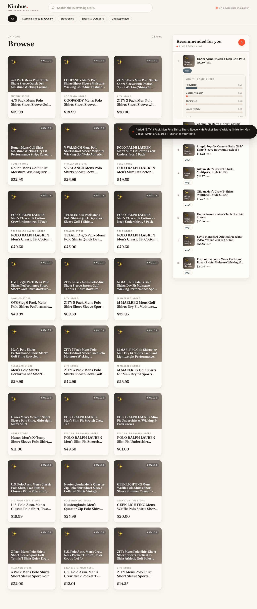

# Nimbus storefront demo

**TL;DR.** Nimbus is a storefront for a fictional "everything store" whose entire
search-and-recommend brain — [edge-reco](../)'s hybrid search and session-aware
recommendations — runs **inside your browser tab**. There is no application backend.
On load, the SPA syncs a **signed, content-addressed catalog bundle** from a CDN edge,
verifies it (ed25519 + sha256) against a **pinned** public key, materializes it into OPFS,
and loads a small embedding model into a Web Worker. From then on, every search,
recommendation, and the **live personalization loop** runs locally: click a few products
and the "Recommended for you" rail visibly re-ranks toward your taste — **no network round
trip per click** — while a **"why?"** panel opens up the engine and shows the score
components (popularity, category/tag/brand affinity, freshness, repetition penalty) behind
each pick.

## Architecture (backend-free)

```
 examples/catalog (signed bundle)        IN THE BROWSER TAB
 ┌───────────────────────────┐          ┌──────────────────────────────────────┐
 │ origin (static files)     │          │ Nimbus SPA (React)                     │
 │  latest / manifest / chunk│          │   sync Worker  ── OPFS ── verify + CAS │
 └────────────┬──────────────┘          │   embedder Worker ── all-MiniLM-L6-v2  │
              │                          │   engine: BM25 ⊕ vector → RRF → rerank │
        edge (Caddy CDN :8081)  ◄────────┤   session profile (clicks, in-tab)     │
              signed bundle, CORS, cache └──────────────────────────────────────┘
```

The flow, end to end:

1. **Sync (in-browser).** A Web Worker pulls `/latest` from the Caddy edge, verifies its
   detached ed25519 signature against a **pinned** public key, fetches only the missing
   content-addressed chunks, verifies every chunk's sha256 fail-closed, and reassembles the
   index files into OPFS. The pinned key ships in the SPA build (`public/public.key`) and is
   served from the app's **own** origin — never fetched from the (untrusted) bundle origin,
   which would defeat pinning.
2. **Load the model (in-browser).** A second Worker loads `all-MiniLM-L6-v2` via
   transformers.js — the byte-for-byte equivalent of edge-reco's Python query encoder.
3. **Search/recommend (in-browser).** The engine embeds the query in-tab, runs BM25 keyword
   scoring ⊕ vector cosine, fuses them with **RRF**, and applies the **session-aware reranker**
   — the same pipeline edge-reco runs server-side, matched to top-k parity (cosine = 1.0).
4. **The loop that matters:** a product click folds into the in-tab **session profile** (no
   network); the next recommend re-ranks toward your taste. Click → re-rank, entirely in-tab.

The same engine code is parity-tested against the Python backend; the backend is no longer in
the request path for this demo (it remains available for the API-server use case — see below).

## Screenshot



*The "Recommended for you" rail (right) re-ranks live as you click; the session badge counts
the signals captured this session. (Produced by the Playwright e2e run — see `make test`.)*

## Quickstart — one command, no backend

You need only this repo and Docker:

```bash
cd demo
docker compose up --build
```

Then open **http://localhost:5173**. You will see the boot screen step through
*syncing the signed bundle → reassembling the index → loading the model*, then the
storefront. **Stop the `origin` and `edge` containers and reload** — the bundle is in
OPFS and the model is in the HTTP cache, so the store still works offline after the
first load.

What's running: `origin` (static signed bundle) → `edge` (Caddy CDN on :8081) → `frontend`
(the static SPA on :5173). The browser does all the search. No FastAPI, no Python in the path.

### Iterate on the SPA locally (`make dev`)

```bash
cd demo
make install   # one-time: frontend (npm) deps
# Serve the signed bundle from the edge so the SPA can sync it:
docker compose up -d origin edge
make frontend  # Vite dev server on http://localhost:5173
```

The dev SPA reads `VITE_BUNDLE_BASE_URL` (default `http://localhost:8081`, the edge).

## Demo flow (the realistic one)

1. **Open the store** at http://localhost:5173. After the boot screen, the grid shows the
   728-product Amazon catalog; the "Recommended for you" rail starts cold (no signals yet).
2. **Search** for something — e.g. `wireless headphones`. The query is embedded **in your
   tab**; the grid swaps to fused BM25 + vector results.
3. **Click 2–3 products in one category** (say, audio gear). Each click folds into the in-tab
   session profile and a toast confirms it was added to your taste — **no network call**.
4. **Watch the rail re-rank** toward that category after each click, and the **session badge**
   increment as signals accumulate.
5. **Open "why?"** on a recommended card to see the **score bars** — popularity,
   category/tag/brand match, freshness, and the repetition penalty — the engine explaining
   why it surfaced that product for *you*.

Sessions are **per-tab** and held in memory; reload to start from a clean slate.

**Tests** (units + the browser e2e that proves the backend-free loop and captures the
screenshot):

```bash
cd demo/frontend
npm run test          # Vitest units (incl. the in-Node click→re-rank loop over the real bundle)
npm run test:e2e      # Playwright: full backend-free loop in a real browser (see below)
```

## The optional API backend

`demo/backend/` is still here: a thin FastAPI wrapper around edge-reco for the **server-side
API** use case (it syncs the same signed bundle at startup and serves `/search`,
`/recommend`, `/products`). It is **not** needed for this demo and is **not** in the default
`docker compose up`. If you want to run the API server, see `make backend` / `demo/backend/`.

## Config

| Var | Side | Default | Purpose |
| --- | --- | --- | --- |
| `VITE_BUNDLE_BASE_URL` | frontend | `http://localhost:8081` | Caddy edge origin the **browser** syncs the signed bundle from. Baked at build time. |

The ed25519 verify key is **pinned in the SPA build** (`demo/frontend/public/public.key`,
copied from `examples/keys/public.key`) and served same-origin — it is not configurable at
runtime, by design.

## What this shows about edge-reco

That the *same* engine that does keyword + semantic search and turns a stream of clicks into
personalized, self-explaining recommendations can run **entirely on the device** — synced from
a signed bundle over a dumb CDN, with no server-side compute in the request path. The
storefront is a thin client over a stable, typed engine API that happens to live in the tab.
