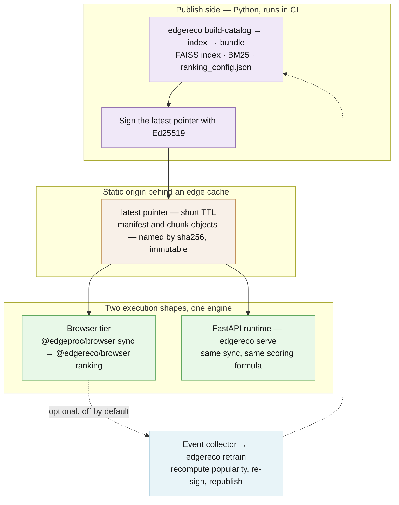
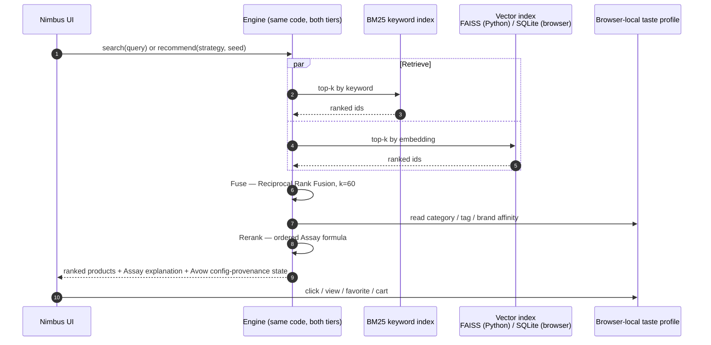
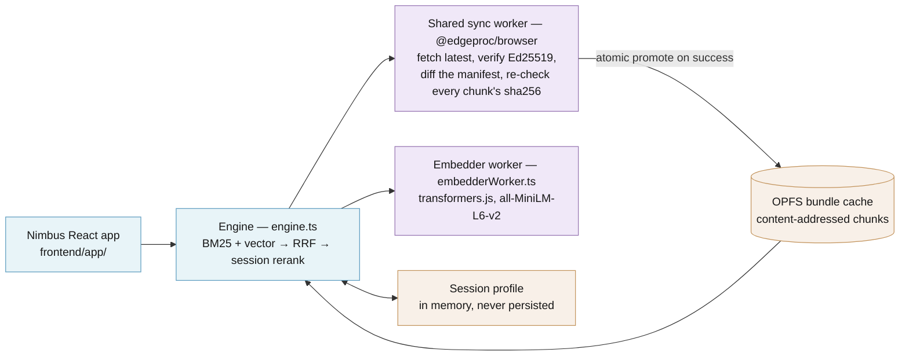
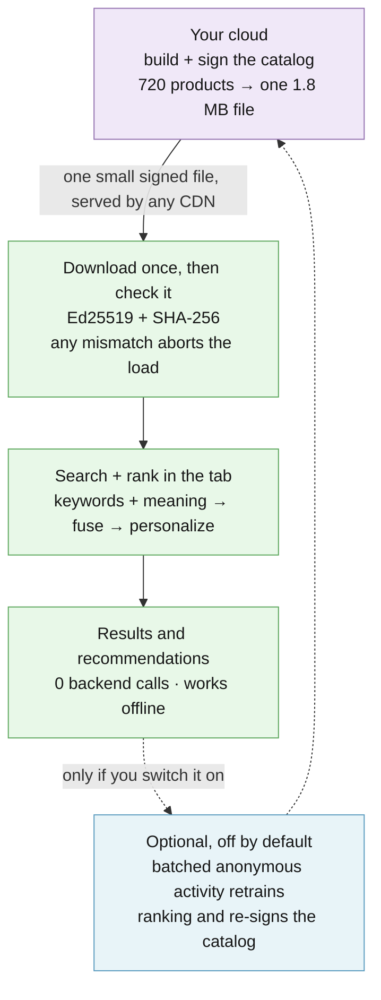

# Architecture

EdgeReco runs a store's recommendation engine on the shopper's device instead of in the cloud — so serving cost stops scaling with traffic and there's no backend to overprovision for Black Friday. Architecturally it's a hybrid product-discovery engine that runs **the same pipeline on the server and in the browser**. The headline demo (Nimbus, our example store) runs entirely in the tab; the FastAPI runtime is the same engine packaged as an API server. One source of truth, two execution shapes.

Three pieces, composed from a shared browser Lego:

- **`backend/`** — Python build-side. Catalog ingest, embedding, FAISS index build, BM25 build, signed-bundle publish.
- **[`@edgeproc/browser`](https://github.com/hseshadr/edgeproc-browser)** — the standalone browser substrate: signed-bundle sync into OPFS, integrity, Worker transport, and vector adapter contracts.
- **`frontend/packages/edgereco-browser/`** — `@edgereco/browser`. EdgeReco's transformers.js embedder, hybrid search, ranking, and session logic composed over that substrate.
- **`frontend/app/`** — the Nimbus React storefront. Thin UI over `@edgereco/browser`; no app server in the request path.

The cross-cutting substrate is **[edge-proc](https://github.com/hseshadr/edge-proc)** — a content-addressed, signed-bundle sync engine, plus the BM25 ⊕ vector → RRF retrieval primitives both tiers run. EdgeReco uses it to ship the prebuilt index from the build host to every edge / device, fail-closed on signature, and to do the local retrieval once the bundle is resident. **This is what makes on-device search possible** — EdgeReco is the product brain (scoring formula, session signals, reranker) layered on top.

The whole system is four repositories that compose as one stack:

| Repo | Role |
| --- | --- |
| [**edge-reco**](https://github.com/hseshadr/edge-reco) (this repo) | the product brain — scoring formula, session signals, session-aware reranker, the Nimbus demo storefront. |
| [**edge-proc**](https://github.com/hseshadr/edge-proc) | the reusable local-compute substrate — signed bundle sync, content-addressed OPFS/CAS cache, fail-closed Ed25519 + SHA-256 verification, BM25 ⊕ vector → RRF retrieval. |
| [**edgeproc-browser**](https://github.com/hseshadr/edgeproc-browser) | the reusable browser substrate — signed sync, OPFS/CAS, Worker transport, integrity, and swappable vector indexes. |
| [**edgeproc-core**](https://github.com/hseshadr/edgeproc-core) | the vector-partitioning protocol edge-proc builds its local vector index on (formerly `shared-libs-python`). On PyPI as [`edgeproc-core`](https://pypi.org/project/edgeproc-core/). |

The backend installs `edge-proc` and `edgeproc-core` from PyPI (`uv.lock` pins the exact releases), and the frontend installs `@edgeproc/browser` from a pinned GitHub commit — see [`GETTING_STARTED.md`](GETTING_STARTED.md). You only clone edge-reco. [privacy-core](https://github.com/hseshadr/privacy-core), by the same author, is unrelated: it redacts personal data from AI prompts and is not part of this stack.

## System context



The publisher signs the bundle once. The CDN/edge serves immutable chunks and a short-TTL `latest` pointer. Both runtimes verify it against a pinned ed25519 public key. Python opens the prebuilt FAISS artifact; the browser imports the authenticated `embeddings.f32` rows into SQLite + sqlite-vector in a dedicated Worker and persists that database in OPFS. No browser FAISS or packed in-memory vector fallback exists. After sync, the runtime is offline-capable.

## Request lifecycle



A query goes through three stages, on whichever tier is running it:

1. **Retrieve** — BM25 (keyword) plus the tier's exact vector adapter — FAISS in Python, SQLite + sqlite-vector in the browser — return top-k candidates over the same id space. Vector retrieval is exact flat search (FAISS `IndexFlatIP` / sqlite-vector full scan); that is fine at demo scale (720 products), and there is no ANN index yet.
2. **Fuse** — Reciprocal Rank Fusion (`rrf_score(d) = Σ 1/(k + rank_i)`) merges the two lists without depending on raw scores.
3. **Rerank** — the session-aware scorer applies the published formula.

Same product algorithm in `backend/src/edgereco/search/` and `frontend/packages/edgereco-browser/src/engine/`. The browser tier is parity-tested against the Python tier over identical bytes from the signed bundle (parity fixtures generated by `backend/scripts/gen_*_fixture.py`). Generic sync and storage behavior is owned and tested once in `edgeproc-browser`.

### Recommendation candidate pool

`/recommend` has no query, so instead of Retrieve→Fuse it selects a candidate pool, then reranks it with the same scorer (`reco/pool.py`, mirrored in `poolSelection.ts`):

- **Cold** (empty session profile) → the popularity top-N. Unchanged legacy behavior.
- **Warm** (the session has clicked things) → the products **matching the session's category/tag/brand affinity**, so "Recommended for you" reflects demonstrated interest. The rerank then orders those matches by the full formula (popular-within-your-interests first). Popularity backfills only when there are fewer than `limit` matches.

This is a standard two-stage recommender (retrieve-by-affinity → rank-by-score). The scoring *formula* is unchanged; only candidate *selection* differs cold vs warm. It is what makes clicking a few products visibly shift the rail toward that category in the demo.

### Recommendation strategies (the rails)

A **strategy** is a named pair — *candidate policy* + *scoring weights* — carried in the signed bundle (`ranking_config.json`, typed `Strategy` in `reco/ranking_config.py`). The engine exposes `recommend({ strategy, seed })` (defaults `strategy: "for_you"`) and `similar(productId)`; both tiers resolve the policy + weights from the synced config, so adding or retuning a rail is a **data republish, no code change**. The candidate policy is a closed enum — `affinity_first | popularity | freshness | vector_similarity | co_occurrence` — dispatched in `reco/pool.py` (mirrored in `poolSelection.ts`).

The seed bundle ships seven strategies:

| key | rail label | candidate policy | leans on | seed |
|---|---|---|---|---|
| `for_you` | Recommended for you | `affinity_first` (warm/cold) | the default weights, verbatim | — |
| `trending` | Trending now | `popularity` top-N | popularity | — |
| `new_arrivals` | New arrivals | `freshness` top-N | freshness | — |
| `similar_items` | Similar items | `vector_similarity` (kNN to seed) | similarity + popularity | product |
| `because_viewed` | Because you viewed this | `vector_similarity` (kNN to last-viewed) | similarity + light affinity | product |
| `also_bought` | Customers who bought this also bought | `co_occurrence` | co-occurrence + popularity | product |
| `frequently_bought_together` | Frequently bought together | `co_occurrence` (tighter cut, `co_occurrence_top_k: 3`) | co-occurrence | product |

`vector_similarity` is the one genuinely new retrieval primitive: an exact search by a product's stored vector (`nearest(product_id, k)` in both tiers, excluding the seed). Python reconstructs it from FAISS; the browser reads and searches it through the SQLite-vector Worker. Its candidates carry a per-candidate `similarity` (cosine to seed) that the scorer adds as `+ weights.similarity · similarity`; `co_occurrence` candidates carry a `cooccurrence` score added the same way. For every other strategy those two signals are absent/0. Assay still emits all nine ordered rows, so “How calculated” never hides a zero-valued term.

The **product-detail page (PDP)** that hosts the seed-based rails is **state-based, not routed**: `Storefront.tsx` flips a `view` between `{ kind: "browse" }` and a product view (`ProductDetail.tsx`), so there is no URL to deep-link to a missing route — the **no-404 property** of a static Pages deploy is preserved. Home stacks For You / Trending / New arrivals via `RailStack`; the PDP stacks Similar items / Because you viewed / Customers also bought / Frequently bought together. Each rail is guarded — an empty or throwing strategy is simply hidden — so a bundle that predates a strategy degrades gracefully to the rails it can serve.

### Co-occurrence ("customers also bought")

`cooccurrence.json` (`reco/cooccurrence.py`, typed `CooccurrenceMatrix`) is a sparse top-N item-to-item neighbour map. It is computed in **retrain**, not at serve time: from the collected session log, each interaction contributes its retrain engagement weight (cart 4, favorite 3, click 1, view 0.2) to that product's per-session engagement vector, and a neighbour's score is the **cosine similarity** between two products' engagement vectors (high-intent baskets weigh more than passive views; self excluded, pairs symmetric, top-N kept). The result ships in the signed bundle as one more artifact; the `co_occurrence` strategies read the seed's neighbours as their candidate pool. The browser mirror (`cooccurrence.ts`) parses the **same verified bytes** and **fails closed** on a malformed-but-signed matrix (a non-finite neighbour score throws rather than feeding NaN into the scorer), keeping the two tiers byte-identical. It is parity-fixture-gated like the rest of the engine (see [Cross-tier parity](#cross-tier-parity)).

### Scoring formula

```
score = retrieval
      + w_popularity·popularity
      + w_category·category_affinity
      + w_tag·tag_affinity
      + w_brand·brand_affinity
      + w_freshness·freshness
      + w_similarity·similarity
      + w_cooccurrence·cooccurrence
      − w_repetition·was_recently_viewed
```

Assay 0.5 executes those terms in the displayed order with ordinary binary64
left-to-right arithmetic. Retrieval’s coefficient is 1; each strategy supplies all
eight remaining coefficients through its `ScoringWeights`. Avow signs only the static
formula probes plus the complete ranking-config hash. Personalized scores are never
signed.

Recently-viewed products get penalized; matching categories / brands / tags get amplified. Session affinity accumulates per click / view / favorite / cart event in the `SessionProfile`.

The normalized RRF term exists only on query search; recommendations have no query
and therefore use `personalized_score` only. Its 0.20 ceiling is a mirrored engine
invariant, regression-tested in both tiers and against the real q8 browser model. It
keeps an exact query match from being discarded merely because a different candidate
is more popular or personalized, while leaving room for those signals to refine the
fused candidate set.

The personalized weights are **not hardcoded** — they ride in the signed bundle as `ranking_config.json` (typed `RankingConfig`, `reco/ranking_config.py`); each named strategy carries its own copy of the same `ScoringWeights` shape (plus the optional `similarity` and `cooccurrence` terms, default 0). Both tiers read the weights off the verified config at sync time; `DEFAULT_RANKING_CONFIG` reproduces the values above and is the fallback for a bundle that predates the file. Retuning personalized ranking is therefore a **data republish** (re-sign a new `ranking_config.json`), not a code change — and parity holds because both tiers read the same signed bytes. Every weight is range-constrained `>= 0` (`Field(ge=0)`), and a `schema_version` gates the shape, so a tampered or negative weight in a signed config fails Pydantic validation fail-closed rather than silently skewing the ranking.

## Backend tier (Python)

`backend/src/edgereco/`:

| Module | Responsibility |
|---|---|
| `catalog/` | Ingest, normalize, and load product catalogs (`build-catalog`, `preprocess`, `loader`, `models`) |
| `embeddings/` | Sentence-transformers `all-MiniLM-L6-v2` encoder + FAISS `IndexFlatIP` build |
| `search/` | BM25 keyword search, vector search, hybrid (RRF) fusion |
| `reco/` | Session-aware reranker, scoring, signals (click/view/favorite/cart) |
| `api/` | FastAPI routes (`/search`, `/recommend`, `/events`), CORS, deps wiring |
| `edge/` | Signed-bundle sync (via edge-proc), publish, manifest, materialize |
| `telemetry/` | Bounded ring buffer of recent envelopes |
| `cli.py` | Typer entrypoints (`build-catalog`, `preprocess`, `index`, `bundle`, `serve`, `search`, `retrain`, `audit`) |
| `config.py` | Pydantic-settings: env-driven bundle URL / verify key / cache dir |

Publish-side: `edgereco bundle` chunks the index dir under GearCDC, writes each chunk under its sha256, builds a manifest, signs a `/latest` pointer.

Serve-side (when running as API server): `edgereco serve` syncs the signed bundle (or reads a flat dir for tests), constructs the `ServiceContainer`, and exposes the FastAPI app. CORS allows the SPA's origin.

## Browser tier (`@edgereco/browser` over `@edgeproc/browser`)

`frontend/packages/edgereco-browser/src/`:



- **Sync substrate (`@edgeproc/browser`)** — standalone Worker that fetches `/latest`, verifies ed25519 against a SPA-pinned public key, diffs the manifest against the OPFS cache, fetches missing chunks, re-checks every chunk's sha256, and atomically promotes the new version.
- **Embedder** — `Xenova/all-MiniLM-L6-v2` via transformers.js. Parity-tested against the Python encoder at cosine ≥ 0.99.
- **Engine** — same BM25 + vector + RRF + session rerank as the backend, but in TypeScript. Parity-tested against the Python search at top-k identity over the real `examples/catalog` bundle.
- **Storage** — OPFS for the bundle cache (plus the library's IndexedDB anti-rollback floor); in-memory for the session profile.
- **Worker boundary** — sync runs in a Worker so the UI thread is never blocked on a multi-MB bundle fetch.

The SPA consumes the private `@edgereco/browser` workspace package and the standalone `@edgeproc/browser` dependency at an exact public Git commit. No shared source or sibling checkout is required.

## Frontend tier (Nimbus storefront)

`frontend/app/`:

A React + Vite SPA over `@edgereco/browser`, which composes `@edgeproc/browser`. The app boots through an intro landing page (its performance tiles quote a dated, recorded measurement of the live site — `src/metrics/live-measurement.json`, written by `pnpm run measure:live` in real Chromium — through `src/metrics/landing-figures.ts`, and `landing-figures.test.ts` recomputes every tile from the raw runs); once launched, the store shows a live `MetricsStrip` of real per-session numbers (recommend latency, backend calls, cold start, JS heap, catalog size). The home page is a 720-product Amazon catalog grid (balanced across 12 categories) with a search box and a `RailStack` of *For You* / *Trending* / *New arrivals* rails — the For You rail re-ranks live as the user clicks, favorites, adds to cart, or lingers; Trending / New arrivals are stable. Clicking a product opens the PDP (`ProductDetail.tsx`; a `#/p/<id>` hash history entry, no router library, so browser Back stays in-app and a reload restores the view) with its seed-based rails — *Similar items*, *Because you viewed*, *Customers also bought*, *Frequently bought together*. The taste itself is durable on the device: every folded interaction appends to an OPFS taste log (`src/signals/tasteLog.ts`, rolling 500-event window, no PII), boot replays it through the same fold with the bundle's `interaction_weights` to rebuild the profile, and a "Reset taste" control next to the For-You badge wipes log + profile back to baseline — still zero backend calls. The headline demo — `cd backend && uv run poe demo` (or `cd frontend && docker compose up` for a Docker-only run) — brings up the static signed-bundle origin + Caddy edge + the SPA; the browser does the search.

The SPA pins the verify public key (`public/public.key`) at build time — it never trusts the origin for the key. That trust root may be a raw 32-byte Ed25519 key or an `edgeproc.keyring/v1` JSON keyring (key rotation + revocation). The sync Worker and the ranking-proof check both parse it with `@edgeproc/browser`'s `parseTrustRoot`, so the two readers always agree on its format.

The browser keeps the highest accepted `latest` pointer as an anti-rollback floor (OPFS + IndexedDB), even when the current key can't verify it. A publish must therefore keep `sequence` strictly increasing **across signing keys**, and keep `bundle_id` / `channel` stable. Rotate keys through a keyring trust root, never by swapping `public.key` (see [DEPLOY.md → Signing keys, the release `sequence`, and rotation](DEPLOY.md#signing-keys-the-release-sequence-and-rotation)). A shopper whose floor can't be satisfied sees a fail-closed integrity refusal. The boot screen then offers an explicit **Clear cached catalog and retry** (`EngineRuntime.clearBundleCache()`), which is never automatic. A rollback refusal gets a tampering warning and a second confirm click first. It clears only the synced catalog and its floor, then boots again.

Two cross-cutting layers run under the UI: an **i18n layer** (`i18next` + `react-i18next`, initialized in `src/i18n.ts` with bundled offline English catalogs under `src/locales/`, so every user-facing string resolves through `t()`), and a **canonical-errors layer** ([`@edgeproc/errors`](https://www.npmjs.com/package/@edgeproc/errors), installed from npm, wired via `src/api/syncErrors.ts` — the one module that names the library — to classify bundle-sync failures into stable codes).

## Where edge-proc fits in

edge-proc is the **signed-bundle delivery substrate**. EdgeReco depends on it for two things:

1. **Publish** — `edgereco bundle` is a thin wrapper over `edgeproc publish`. Chunks → manifest → signed pointer.
2. **Sync** — both `ServiceContainer.from_synced` (Python) and `BrowserSync` (TypeScript) verify and pull bundles via the same content-addressed contract.

edge-proc itself is a generic library; EdgeReco is one possible consumer. It in turn builds its local vector index on the vector-partitioning protocol in **[edgeproc-core](https://github.com/hseshadr/edgeproc-core)** — the bottom of the stack. See [edge-proc/docs/ARCHITECTURE.md](https://github.com/hseshadr/edge-proc/blob/main/docs/ARCHITECTURE.md).

## Cross-tier parity

The two tiers are kept honest by three fixtures generated from the Python source of truth:

- `embedding_parity.json` — vectors for representative strings; the TS embedder must match each at cosine ≥ 0.99.
- `search_parity.json` — a synthetic query vector + the ordered top-k that Python returns over the real bundle's `embeddings.f32`.
- `hybrid_parity.json` — query strings + the full BM25 ⊕ vector → RRF → empty-session-rerank top-k from `/search`.
- `strategy_parity.json` — per-strategy `recommend({ strategy, seed })` top-k (the Phase-2 rails), so the browser's strategy dispatch + per-strategy weights match Python.
- `cooccurrence_parity.json` — the seed's co-occurrence neighbours + the `also_bought` / `frequently_bought_together` top-k, so the browser's co-occurrence math matches Python over the committed bundle's `cooccurrence.json`.

Regenerate via `backend/scripts/gen_*_fixture.py`. The product parity tests under `frontend/packages/edgereco-browser/src/engine/` consume them.

Freshness comparison preserves score and configuration sensitivity: every float
uses `rel_tol=1e-6` and `abs_tol=1e-12`, except the measured embedding-vector
paths (`query_vector[*]` and `items[*].vector[*]`), which permit at most `2e-7`
absolute ARM/x86 ONNX drift. IDs, ordering, counts, schemas, and all other values
that are not floats remain exact.

## Invariants (load-bearing rules)

- **Scoring formula** is the contract between the two tiers. The *weights* now live in the signed `ranking_config.json` (both tiers read them off the verified bundle), so retuning ranking is a data republish — no code edit. The scoring *math* (`scorer.py` ↔ the `@edgereco/browser` rerank module) is still mirrored code; change it on both sides together, and both unit suites and the parity fixtures must update.
- **Hybrid search**: BM25 + exact vector search + RRF, in that order. The vector implementation is FAISS on Python and SQLite + sqlite-vector/OPFS in the browser.
- **Catalog sync**: signed, content-addressed, fail-closed on tampering. No exception.
- **Zero backend calls after sync**: once the bundle is local, the runtime is offline-capable. Don't introduce a runtime backend dep.
- **Uplink is optional & off the inference path**: search / recommend / rerank / sync make zero backend calls. The flywheel uplink (a click is captured in-tab, persisted, then batched as a fire-and-forget beacon to the `/events` collector) is gated by `VITE_EVENTS_URL` — **unset = fully disabled** — and must never block or break the app. It feeds the cloud's retrain; it never gates the in-tab rail re-rank.
- **Retrain is a data change, not a formula change**: the cloud retrain (`edgereco retrain`) aggregates collected events, recomputes `popularity_score` (from the collector's `--events-url`) **and the `cooccurrence.json` neighbour map (from a `--sessions` JSONL log)**, and republishes a re-signed bundle. It must *only* move those data artifacts — never the scoring weights — so both tiers pick up the new ranking on sync with no code change. It reuses the prebuilt FAISS `vector/` verbatim (embeddings are text-derived, popularity-independent). Republish to a runtime origin; the committed seed bundle and the browser parity fixtures stay byte-stable. The read-only `edgereco audit` surface previews exactly what a retrain would change — event counts, top popularity movers, changed co-occurrence edges — and must never sign, publish, or touch the inference path.

## Release reliability and performance contract

The browser release gate uses the committed 720-product catalog, the real q8
MiniLM model, ONNX/WASM, signed-bundle sync, and headless Chromium. Budgets are
chosen from the demo promise (a short first-load screen, then visibly instant local
search), before measurement:

- cold launch to query-ready: **≤30 s**;
- ten warm realistic searches: **p50 ≤300 ms, p95 ≤750 ms**;
- steady Chromium JavaScript heap after those searches: **≤512 MiB**;
- post-ready search/recommend application backend calls: **0** and third-party
  requests during search: **0**. Remote catalog image URLs render as local editorial
  placeholders; Hugging Face, jsDelivr, fonts, and image CDNs are never contacted;
- engine Worker requests time out at **60 s** and first model embedding at **300 s**;
  crashes reject every pending request, and the boot UI exposes a tested Retry path;
- the optional API session store retains at most **10,000** sessions and expires a
  session after **1 hour** idle. API search/recommend request limits remain capped at
  100.

Run the measured browser contract with
`pnpm -C frontend -F frontend test:e2e:c1`; the search-quality spec prints boot,
p50, p95, and heap measurements and fails on any budget or egress regression. The
minified offline suite separately boots with model CDNs blocked, reloads after
network cutoff, and proves signed-cache recovery. Production health additionally
requires the exact-SHA and canonical-host checks in `.github/workflows/deploy.yml`.

## The pipeline at a glance



Everything in green happens on the shopper's own device. Your cloud is touched only to
publish a new catalog, never to answer a search.

- **origin** serves a *signed, content-addressed bundle*: the products, the prebuilt
  search index and the ranking weights. *Content-addressed* means every piece is named by
  the hash of its own bytes, so it can be cached forever and cannot be changed without
  detection. It is a `latest` version pointer plus immutable `manifest/<hash>` and
  `chunk/<hash>` objects. A committed 720-product bundle lives in
  `backend/examples/catalog/` (1.8 MB on disk).
- **edge** is a Caddy reverse proxy (a small static web server standing in for a CDN)
  with the cache policy: immutable chunks cached forever, a short-lived pointer.
- **browser tier**: the Nimbus single-page app syncs the bundle (fetches it, checks its
  signature, stores it) into **OPFS** (Origin Private File System, the browser's private
  per-site disk). It verifies Ed25519 signatures and SHA-256 checksums against a key
  built into the app and aborts on any mismatch, loads the `all-MiniLM-L6-v2` model, and
  runs the whole pipeline in the tab. No application server is in the request path.
- **edgereco runtime (Python)**: the same engine as a FastAPI app for the server-side
  case. Same scoring formula, same sync and verify, same prebuilt index; the browser
  engine is tested for parity against it.

The Python side depends on [`edge-proc[localvec,bundles]`](../backend/pyproject.toml).
The browser side depends on the standalone
[`@edgeproc/browser`](https://github.com/hseshadr/edgeproc-browser) package for signed
sync, integrity checks, Workers, OPFS and vector contracts, while this repo's
[`@edgereco/browser`](../frontend/packages/edgereco-browser/) package owns only the
recommendation-specific embedding, search, ranking and session logic.

## Delivery and updates

The whole engine ships as static files: the app code, plus the signed bundle holding the
products, the prebuilt vector index, the ranking weights and the "also bought" map. The
live demo serves all of it from Cloudflare Pages on its own origin; any static host
works.

Updates are a patch, not a re-download. Because every piece is named by the hash of its
bytes, a client compares the new manifest with what it already has and fetches only the
pieces that changed, reusing the rest (notably the large vector index). A retrain that
only moves popularity scores and "also bought" links re-fetches a few small pieces. As
[DEPLOY.md](DEPLOY.md) puts it: *"a one-line edit re-publishes one chunk; every consumer
fetches one chunk and reuses the rest."*

## Offline use and install

Nimbus is a PWA (Progressive Web App: a site the browser can install like an app). After
the first visit it works with no network. A service worker precaches the app shell on
first load; the language model and its runtime stay in the browser's own caches. The
signed catalog is already in OPFS, and the service worker deliberately never touches it,
so its signature checks are unchanged.

Product photos are copied into the build and served from the demo's own address
(`/images/`), so browsing never tells an image CDN what you looked at. They are not
precached, so offline a photo shows only if the browser still has it cached. Search,
browsing and every recommendation row work without a connection.

`pnpm -F frontend test:e2e:offline` warms the app online, cuts the network, reloads, and
checks that the store still mounts and ranks. A second test serves the build with
Cloudflare Pages' reserved files withheld, which catches a missing service worker that a
plain local file server cannot see.

## Security and trust model

- **Checked:** the catalog's `latest` pointer, manifest and every chunk (Ed25519 signature
  and SHA-256 hashes) against the public key built into the app
  (`frontend/app/public/public.key`), never a key carried in the catalog. The ranking
  "why?" panel separately checks a signed ranking proof against the same key. The 23 MB
  model and its runtime are pinned by SHA-256 at build time.
- **Refuses rather than warns:** a bad signature, a hash mismatch, a truncated chunk, or
  an older release than one already seen (rollback) aborts the load and shows a sync
  failure. Nothing falls back to unchecked data. A stuck returning shopper gets an
  explicit **Clear cached catalog and retry** button; it never clears on its own.
- **Not protected:** a compromised app origin (it could replace both the code and the
  key), a compromised device or browser extension, or someone with access to the browser
  profile (the catalog is public and the taste log is readable locally). The model files
  are pinned but not covered by the catalog signature. A key revocation reaches a
  returning shopper one page load late; see
  [DEPLOY.md](DEPLOY.md#revocation-lag-the-service-worker-serves-the-trust-root-from-its-precache).
- **Check a release:** [`edge-reco.com/build.json`](https://edge-reco.com/build.json)
  names the exact deployed commit, version and catalog bundle. The Python example in
  [USAGE.md](USAGE.md) syncs and verifies the committed catalog against
  `backend/examples/keys/public.key`.

Full threat model and data inventory: [SECURITY-PRIVACY.md](SECURITY-PRIVACY.md).

## What the tests prove, and what they do not

| Claim | Backed by |
| --- | --- |
| Zero backend calls after sync, and no third-party CDN at runtime | `pnpm -F frontend run test:e2e:offline` (including `cold-blocked.spec.ts`, which boots the store with every external CDN blocked) |
| Works offline after one visit, including on the real host's rules | `test:e2e:offline` (`offline.spec.ts`, `pages-advanced-mode.spec.ts`) |
| A tampered catalog is refused in a real browser | `test:e2e:c1` (`sync.spec.ts`) |
| The browser engine returns the same results as the Python engine | parity fixtures under `frontend/packages/edgereco-browser/src/engine/__fixtures__/` and their tests |
| Cold start, search speed and memory stay inside release budgets | `test:e2e:c1` prints them for your machine and enforces the budgets above |
| The README screenshot is real | taken from a production build (`build:pages` + `vite preview`) of the synthetic catalog after searching "something for my aching back"; refresh it from edge-reco.com once this catalog is deployed |
| The README keeps its plain-English shape | [`backend/tests/unit/test_readme_contract.py`](../backend/tests/unit/test_readme_contract.py) |

They do not prove recommendation quality for your store or shoppers, behaviour on a
particular low-memory phone (no physical-device measurements yet), or that a displayed
result was computed from the signed ranking config.

## Known limits in detail

**Resource floor.** A first launch downloads a roughly 23 MB quantized language model and
a roughly 23 MB ONNX/WASM runtime, then uses more memory while compiling and running
them. The engine starts only after the shopper clicks Launch; simultaneous first
searches share one model load, a failed boot releases both Workers, and the release test
enforces cold-start, search and heap budgets. This is still a real cost on low-memory
phones and laptops, and no minimum device is claimed until physical-device measurements
exist.

**Bundle-sync verification is not displayed.** Signature checking runs on every sync and
a tampered file is refused. The implementation comes from the standalone
[`@edgeproc/browser`](https://github.com/hseshadr/edgeproc-browser) dependency; EdgeReco
keeps no private copy. What does not exist is a screen showing that sync outcome. The
landing page's "verify (Ed25519 + SHA-256, fail-closed)" step is static copy, not a live
result.

**The ranking proof is narrower than result truth.** The "why?" panel has two parts.
**How calculated (Assay)** shows the live formula for that result: every raw signal,
weight, contribution and the final score. **Config provenance (Avow)** reports whether
the publisher signature on a static `edgereco.ranking-proof/v1` payload verifies, whether
its hash matches the complete `ranking_config.json`, and whether its probes (one fixed
synthetic input per strategy, plus search) reproduce their signed outputs. That shows
which config and formula shipped, not that a displayed result was computed from them. It
never signs a shopper's personalized result and does not prove input truth, freshness,
fairness or quality. The committed catalog carries the older receipt shape, which the
browser labels **unavailable**, never verified; a v1 proof appears only after a catalog
republish with the maintainer key.

**The language model is not inside the signed catalog.** It ships as ordinary
same-origin static files (`/models/` and `/ort/`), each pinned to its content hash, so a
first visit fetches everything from the app's own address. Those files are not covered
by the catalog signature. The catalog format could carry the model, signed and patched
like the products; that is a possible next step.

**No origin-to-device handoff.** Because the same engine runs on both sides, a deployment
could serve recommendations from a server while the device downloads its copy in the
background, then switch over. That handoff is not built. Today the browser boot blocks
until ready, and the two shapes are separate deployment choices.

**Not planned yet:** folding the model into the signed catalog, the automatic handoff,
and an approximate index for large catalogs are ideas, not scheduled work.

## When to use something else

| Option | Where it is the better choice | What you give up |
| --- | --- | --- |
| A hosted search/recommendation service (pay per query) | Huge catalogs, merchandising dashboards, A/B testing, and a vendor who runs it | Cost that grows with traffic, and every keystroke crosses the network |
| Your platform's built-in keyword search | Shoppers search by exact product names | Meaning: "aching back" only finds titles that contain "back" |
| Your own search server (for example a vector database behind an API) | Millions of products, or data that must never ship to the browser | A server to run, scale and pay for on the busiest day |
| EdgeReco | Thousands of products, cost that doesn't grow with traffic, and offline use | A one-time download on first visit, and the whole catalog is public |

## CI and release pipeline

`make gate` runs the backend `poe gate` and the frontend `pnpm gate`, the same commands
CI runs through Dagger:

```bash
dagger check                      # full check: same graph locally and on GitHub
dagger check backend-quality      # run one independently cached check
dagger check -l                   # list the checks
dagger call build --commit-sha "$(git rev-parse HEAD)" export --path /tmp/edge-reco-dist
dagger call release-preflight --commit-sha "$(git rev-parse HEAD)" # pinned Wrangler, no creds
```

Dagger owns the repository's release graph. EdgeReco keeps its product build, audits,
CodeQL, parity, browser journeys, signed bundle and model identity, and the live
zero-egress proof. Exact-SHA modules in `hseshadr/ci` own the common repository checks,
artifact envelope, exact-green evidence and Cloudflare Pages delivery. GitHub workflows
only check out the source, select the protected `production` environment for
deployment, and call the pinned Dagger engine. See
[dagger-lego-adoption.md](dagger-lego-adoption.md). GitHub CodeQL Default Setup stays
enabled until the Dagger SARIF check is green on hosted pull requests and can replace it
without a coverage gap.

## Repo layout

- `.github/`: exact-head CI, security scans, and serialized Cloudflare deployment.
- `backend/`: Python project root (`pyproject.toml`, `uv.lock`).
  - `backend/src/edgereco/`: runtime: `catalog/` `embeddings/` `search/` `reco/` `edge/` `telemetry/` `api/` `cli.py` `config.py`
  - `backend/features/`: Gherkin behaviour specs, decoupled from step implementations
  - `backend/tests/`: `unit/` `bdd/` `integration/` `e2e/`
  - `backend/deploy/`: `Dockerfile`, `docker-compose.yml`, Caddy edge config
  - `backend/examples/catalog/`: committed signed 720-product bundle (`latest` + `manifest/` + `chunk/`)
  - `backend/examples/source/catalog.csv`: committed, reproducible build source (12 balanced categories)
  - `backend/examples/keys/public.key`: pinned Ed25519 verify key for the bundle
  - `backend/demo_server/`: optional FastAPI launcher (not in the main checks); ships the synthetic fixture
  - `backend/scripts/`: `curate_demo_catalog.py` and browser parity-fixture generators
- `frontend/`: pnpm workspace root (`package.json`, `pnpm-workspace.yaml`, `pnpm-lock.yaml`).
  - `frontend/app/`: Nimbus React storefront (syncs and runs the engine in the browser)
  - `frontend/packages/edgereco-browser/`: `@edgereco/browser`, EdgeReco-specific embedding, hybrid search, ranking and session logic
- `docs/`: this file, `GETTING_STARTED.md`, `USAGE.md`, `QUICKSTART.md`, `DEPLOY.md`, `SECURITY-PRIVACY.md`

## Further reading

- [`GETTING_STARTED.md`](GETTING_STARTED.md) — developer setup, the full check, a first change.
- [`USAGE.md`](USAGE.md) — the Python library, CLI, learning loop and configuration.
- [`QUICKSTART.md`](QUICKSTART.md) — clone → run.
- [`DEPLOY.md`](DEPLOY.md) — backend-free in-browser vs edge-origin shapes.
- [`SECURITY-PRIVACY.md`](SECURITY-PRIVACY.md) — threat boundaries, data flow,
  egress, retention, and operator requirements.
- [`DEPLOY.md`](DEPLOY.md) — the artifact-distribution and bundle-lifecycle diagrams
  live there, next to the deployment shapes they describe.

All diagrams in this repo are inline Mermaid. There is no diagram build step and no
committed image to go stale: GitHub renders the fences natively, and a diagram edit
shows up as a readable diff in review.
